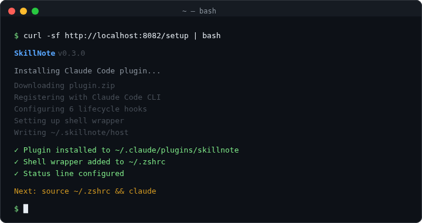
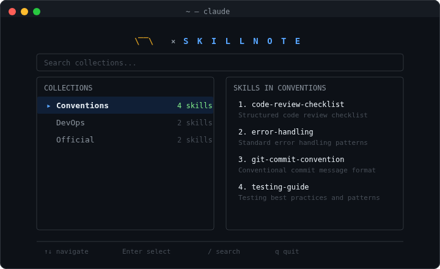
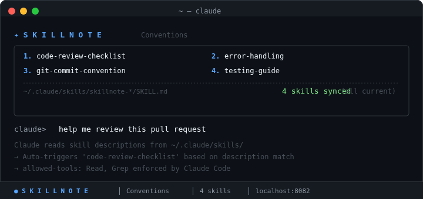
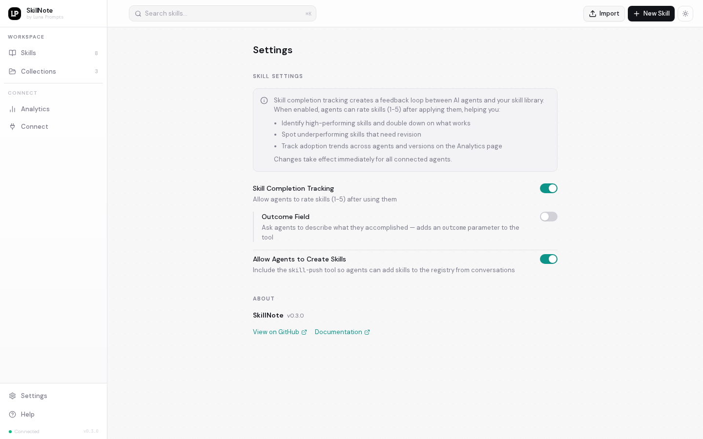

<p align="center">
  
</p>

<h1 align="center">SkillNote</h1>

<p align="center">
  <strong>The open-source skill registry for AI coding agents.</strong>
  <br />
  Create, manage, and distribute <code>SKILL.md</code> files — with a Claude Code plugin that makes it seamless.
</p>

<p align="center">
  <a href="https://github.com/luna-prompts/skillnote/blob/master/LICENSE"></a>
  <a href="https://github.com/luna-prompts/skillnote"></a>
  <a href="https://github.com/luna-prompts/skillnote/issues"></a>
  <a href="https://discord.gg/GazU4amU6H"></a>
  
  
</p>

<p align="center">
  <a href="#quick-start">Quick Start</a> &middot;
  <a href="#the-claude-code-experience">Experience</a> &middot;
  <a href="#collections--per-project-scoping">Collections</a> &middot;
  <a href="#skill-reviews--ratings">Reviews</a> &middot;
  <a href="#web-ui">Web UI</a> &middot;
  <a href="#self-hosting">Self-Hosting</a> &middot;
  <a href="#contributing">Contributing</a>
</p>

<br />

<p align="center">
  
</p>

---

## Why SkillNote?

AI coding agents like Claude Code use `SKILL.md` files to learn new capabilities. But managing these files is painful:

- They live scattered across `~/.claude/skills/` with no versioning or search
- No way to share across projects, machines, or teams
- Writing good skills from scratch means guessing what works — no feedback on what agents actually use

**SkillNote fixes this.** It's a self-hosted registry with a web UI for managing skills, a Claude Code plugin that auto-syncs everything, and a built-in feedback loop where agents rate skills after use. One setup command, then skills just work — everywhere, every session.

**Why self-hosted?** Your skills encode institutional knowledge — coding conventions, deploy workflows, project-specific patterns. That shouldn't leave your infrastructure. SkillNote runs entirely on your machines.

---

## Quick Start

```bash
git clone https://github.com/luna-prompts/skillnote.git
cd skillnote
docker compose up --build -d
```

Then connect Claude Code:

```bash
curl -sf http://localhost:8082/setup | bash
source ~/.zshrc
claude
```

That's it. The collection picker appears, you select your skills, and they're active.

<p align="center">
  
</p>

> **LAN/team setup:** `SKILLNOTE_HOST=<your-server-ip> docker compose up --build -d`, then each teammate runs `curl -sf http://<your-server-ip>:8082/setup | bash`

---

## The Claude Code Experience

### Collection Picker

Every time you run `claude`, a full-screen TUI picker appears. Browse collections, preview skills, and select which ones to activate for this project.

<p align="center">
  
</p>

### Session Sync & Status Line

Once you pick a collection, skills sync to `~/.claude/skills/` with full frontmatter. Claude auto-triggers skills when your task matches a skill's description. The status line shows what's active.

<p align="center">
  
</p>

### How It Works Under the Hood

```
┌─────────────────────────────────────────────────────────────┐
│  SkillNote Server (Docker)                                  │
│                                                             │
│  ┌───────────┐  ┌───────────┐  ┌───────────┐               │
│  │  Web UI   │  │  REST API │  │ MCP Server│               │
│  │  :3000    │  │  :8082    │  │  :8083    │               │
│  └───────────┘  └─────┬─────┘  └─────┬─────┘               │
│                       │              │                      │
│                  PostgreSQL          │                      │
│                  pg_notify ──────────┘                      │
└─────────────────────────────────────────────────────────────┘
                        │              │
                   REST API        MCP protocol
                        │              │
┌─────────────────────────────────────────────────────────────┐
│  Claude Code Plugin (~/.claude/plugins/skillnote)           │
│                                                             │
│  SessionStart ──── sync skills to ~/.claude/skills/         │
│  UserPromptSubmit  background re-sync every 60s             │
│  PostToolUse ───── track usage via REST API                 │
│  PostCompact ───── re-inject context after compaction       │
│  SubagentStart ─── inject context into subagents            │
│  Stop ──────────── prompt agent to rate skills used         │
│                                                             │
│  MCP: complete_skill (ratings), skill-push (create skills)  │
└─────────────────────────────────────────────────────────────┘
```

### Why Both Local Skills AND MCP?

| | Local Skills (plugin sync) | MCP Tools |
|---|---|---|
| **`allowed-tools`** | Enforced | Not supported |
| **`context: fork`** | Works | Not supported |
| **`effort`, `model`** | Works | Not supported |
| **Update speed** | ~60s (background) | Instant (real-time) |
| **Offline** | Works (on disk) | Needs network |

Local skills get full Claude Code features. MCP gets real-time delivery and ratings. The plugin gives you both.

---

## Collections & Per-Project Scoping

Claude Code has a ~8,000 character budget for skill descriptions. With more than ~15 skills, descriptions get silently truncated and skills stop triggering. Collections keep things focused.

<p align="center">
  
</p>

- **15 skills max** per collection — keeps Claude's context efficient
- **~8k char budget** — shared across all active skill descriptions
- **1:1 mapping** — each project gets one active collection via `.skillnote.json`

### Automatic Collection Selection

On the first session in a new project folder, the plugin checks if the **folder name matches a collection name**. If it does, Claude offers to scope:

```
$ cd ~/projects/frontend && claude

SkillNote: Collection 'frontend' matches this folder.
Claude: "Want me to scope this project to frontend skills?"
User: [selects frontend] → Enter → .skillnote.json created → 12 skills synced
```

### Manual Override

```json
{"collections": ["frontend", "conventions"]}
```

Create `.skillnote.json` in any project root. The plugin reads it on every sync.

---

## Skill Reviews & Ratings

After an agent uses a skill, it rates it (1-5 stars) and describes what it did. Each skill's detail page shows an Amazon-style reviews section.

<p align="center">
  
</p>

- **Star distribution bars** — see the rating breakdown at a glance
- **Individual review cards** — agent name, version, rating, outcome, time
- **Paginated loading** — first 10 load instantly, "Show more" for the rest
- **Clickable badge** — the `4.2 (18)` pill scrolls to the reviews section
- **Formatted counts** — `12.5k` for large numbers

Toggle rating collection on/off in Settings.

---

## Skill Push

Agents create new skills from conversations. When Claude notices repeated patterns, it offers to save them:

```
User: "use pnpm not npm"  (3rd time this session)

Claude: "Want me to create a skill for this?"
      → drafts the skill → you review → pick a collection → published
      → "Done! 'use-pnpm' is live. All agents get it within 60 seconds."
```

| Command | What it does |
|---------|-------------|
| `/skillnote:skill-push` | Quick capture — guided flow |
| `/skillnote:skill-creator` | Deep creation with eval loops |
| `/skillnote:collection` | Change active collection |

---

## Web UI

### Dashboard
Browse all skills in list or grid view. Search, filter by collection, see star ratings.

### Skill Editor
Notion-style WYSIWYG editor powered by Tiptap. Write in rich text or raw markdown. Import `SKILL.md` files with drag-and-drop. Advanced metadata for Claude Code frontmatter (`allowed-tools`, `context: fork`, `effort`, `model`).

### Version History
Every save creates a snapshot. Browse history, compare versions, restore with one click.

<p align="center">
  
</p>

### Analytics
Track skill usage across all connected agents. Calls, ratings, agent breakdown, timeline — filterable by time range, agent, and collection.

<p align="center">
  
</p>

### Connect
One-page setup instructions with copy-paste install command.

<p align="center">
  
</p>

### Settings
Toggle skill completion tracking, outcome fields, and agent skill creation.

<p align="center">
  
</p>

---

## SKILL.md Format

```markdown
---
name: pdf-extractor
description: Extract text and tables from PDF files. Use when the user mentions PDFs, scanned documents, or form extraction.
collections: [data, documents]
---

# PDF Extractor

When the user provides a PDF file:

1. Use `pdftotext` to extract raw text
2. Identify tables and format them as markdown
3. Preserve headings and document structure
```

With Advanced Metadata (synced locally via the plugin):

```yaml
---
name: pdf-extractor
description: Extract text and tables from PDF files.
allowed-tools: Read Write Bash(pdftotext *)
context: fork
effort: high
---
```

---

## Other Agents

Any MCP-compatible agent can connect directly:

```bash
# Cursor — ~/.cursor/mcp.json
{"mcpServers": {"skillnote": {"url": "http://localhost:8083/mcp"}}}

# Any MCP HTTP agent
http://localhost:8083/mcp
```

> Other agents get skills via MCP (real-time updates, ratings) but not local sync features (`allowed-tools`, `context: fork`). Those require the Claude Code plugin.

---

## Self-Hosting

### System Requirements

| Container    | Image size | RAM (idle) | RAM (under load) |
| ------------ | ---------- | ---------- | ---------------- |
| **Web**      | ~302 MB    | ~37 MB     | ~60 MB           |
| **API**      | ~456 MB    | ~71 MB     | ~120 MB          |
| **MCP**      | ~456 MB    | ~104 MB    | ~160 MB          |
| **Postgres** | ~663 MB    | ~38 MB     | ~80 MB           |
| **Total**    | ~1.9 GB    | **~250 MB**| **~420 MB**      |

### Docker Compose

```bash
git clone https://github.com/luna-prompts/skillnote.git
cd skillnote
docker compose up --build -d
```

**Custom host (LAN / Tailscale):**

```bash
SKILLNOTE_HOST=<your-server-ip> docker compose up --build -d
```

**Local dev:**

```bash
docker compose up --build -d postgres api mcp
npm install && npm run dev
```

### Environment Variables

| Variable | Default | Description |
| --- | --- | --- |
| `SKILLNOTE_HOST` | `localhost` | Host IP/domain (CORS + frontend URL) |
| `SKILLNOTE_API_PORT` | `8082` | API port |
| `SKILLNOTE_MCP_PORT` | `8083` | MCP server port |
| `SKILLNOTE_DATABASE_URL` | *(compose)* | PostgreSQL connection string |
| `NEXT_PUBLIC_API_BASE_URL` | `http://localhost:8082` | Frontend API endpoint |

---

## Tech Stack

| Layer | Technology |
| --- | --- |
| Frontend | Next.js 16, React 19, TypeScript, Tailwind CSS 4, Tiptap |
| Backend | Python 3.12, FastAPI, SQLAlchemy 2, Alembic, Pydantic 2 |
| MCP Server | Python 3.12, FastMCP |
| Plugin | Bash, Python, Claude Code Plugin API |
| Database | PostgreSQL 16 |
| Infra | Docker, Docker Compose |

---

## References

- [Claude Code Skills](https://platform.claude.com/docs/en/agents-and-tools/agent-skills/overview) — Anthropic's skills docs
- [Claude Code Plugins](https://code.claude.com/docs/en/plugins-reference) — Plugin system reference
- [Claude Code Hooks](https://code.claude.com/docs/en/hooks) — Hook events and configuration
- [Model Context Protocol](https://modelcontextprotocol.io) — MCP specification

---

## Star Us

If you find SkillNote useful, please consider giving it a star.

<p align="center">
  <a href="https://github.com/luna-prompts/skillnote"></a>
</p>

---

## Contributing

1. Fork the repository
2. Create a feature branch (`git checkout -b feat/my-feature`)
3. Commit your changes (`git commit -m 'feat: add my feature'`)
4. Push and open a Pull Request

Please follow [Conventional Commits](https://www.conventionalcommits.org/). Join us on [Discord](https://discord.gg/GazU4amU6H).

---

## License

MIT &copy; [Luna Prompts](https://github.com/luna-prompts)

<p align="center">
  Made with care by <a href="https://github.com/luna-prompts"><strong>Luna Prompts</strong></a>
</p>
