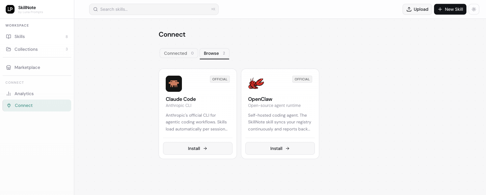
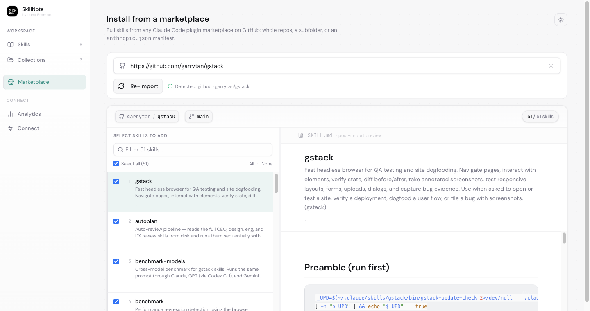

<p align="center">
  
</p>

<h1 align="center">S K I L L N O T E</h1>

<p align="center">
  <strong>The open-source skill registry for AI coding agents.</strong>
  <br />
  Self-host your team's <code>SKILL.md</code> library. Version it, scope it, and ship it to Claude Code and OpenClaw from one CLI.
</p>

<p align="center">
  <a href="https://www.npmjs.com/package/skillnote"></a>
  <a href="https://www.npmjs.com/package/skillnote"></a>
  <a href="https://github.com/luna-prompts/skillnote/pkgs/container/skillnote-api"></a>
  <a href="https://clawhub.ai/latentloop07/skillnote"></a>
  <a href="https://github.com/luna-prompts/skillnote/blob/master/LICENSE"></a>
  <a href="https://discord.gg/GazU4amU6H"></a>
  <a href="https://github.com/luna-prompts/skillnote"></a>
</p>

<p align="center">
  <a href="#quick-start"><strong>Quick start</strong></a> &nbsp;·&nbsp;
  <a href="#the-8000-character-problem">Why</a> &nbsp;·&nbsp;
  <a href="#features">Features</a> &nbsp;·&nbsp;
  <a href="#agent-support">Agents</a> &nbsp;·&nbsp;
  <a href="#architecture">Architecture</a> &nbsp;·&nbsp;
  <a href="#faq">FAQ</a> &nbsp;·&nbsp;
  <a href="https://discord.gg/GazU4amU6H">Discord</a>
</p>

<br />

<p align="center">
  
</p>

---

## The 8,000-character problem

Claude Code shares **~8,000 characters** across every active skill description ([docs](https://docs.anthropic.com/en/docs/claude-code/skills)). Past that limit, descriptions silently truncate. The system prompt forbids using skills that aren't listed in context, so truncated skills are both invisible *and* explicitly off-limits ([#13343](https://github.com/anthropics/claude-code/issues/13343), [#40121](https://github.com/anthropics/claude-code/issues/40121)).

In practice, past ~15 active skills your skills stop working and you can't tell which ones. New teammates have no way to discover what skills the project depends on. Updating a shared skill means re-zipping and re-uploading for everyone. And private skills, like deploy procedures, compliance workflows, or internal API patterns, have nowhere safe to live.

**SkillNote is a self-hosted registry that fixes that.** Per-project collections scope which skills load. Live sync pushes browser edits to every connected agent within 60 seconds. Agents rate skills 1 to 5 after using them, so you finally have signal on what works. Your skills stay on your infrastructure. Your servers, your rules.

| Without SkillNote | With SkillNote |
| --- | --- |
| Skills truncate past ~15 active | Collections scope to 15 per project |
| `~/.claude/skills/` per laptop | One registry, every agent |
| Re-zip + re-upload to share an edit | Edit in browser, every session picks it up in 60s |
| No signal on what actually works | Agents rate every skill they use, 1-5 + comment |
| Private skills have nowhere safe | Self-hosted; never leaves your network |

---

## Quick start

```bash
npx skillnote start
```

Opens <http://localhost:3000>.

Requires **Docker** (running) and **Node.js 20+**. The CLI pulls the published images from GHCR, brings up the web + API + Postgres stack, waits for healthchecks, and opens the dashboard. About 30 seconds on a warm cache.

```text
┌────────────────────────────────────────────┐
│  SkillNote ▸  the skill registry for AI    │
│  v0.5.2 · github.com/luna-prompts/skillnote│
└────────────────────────────────────────────┘
◇  Prerequisites ok
◇  Images pulled
◇  Containers running
◇  Services healthy

╭────────┬──────────────────────────────╮
│ Web UI │ http://localhost:3000        │
│ API    │ http://localhost:8082        │
╰────────┴──────────────────────────────╯
```

<details>
<summary><b>Other ways to install</b></summary>

**Docker Compose directly** (no Node):

```bash
curl -fsSL https://raw.githubusercontent.com/luna-prompts/skillnote/cli-v0.5.2/deploy/docker-compose.yml -o docker-compose.yml
docker compose up -d
```

**LAN-accessible** for teammates on the same network:

```bash
SKILLNOTE_HOST=<your-lan-ip> docker compose up -d
```

**Podman**: `npx skillnote start` is Docker-only, but the Compose path and `install.sh` both work with `podman compose` (Podman 4+) or `podman-compose`.

**Building from source** (contributors):

```bash
git clone https://github.com/luna-prompts/skillnote.git
cd skillnote && ./install.sh
```

`install.sh` builds from local source instead of pulling published images. Auto-detects `docker compose`, `podman compose`, or `podman-compose`.

</details>

### Lifecycle commands

```text
npx skillnote start         # boot + open UI
npx skillnote stop          # halt; volumes preserved
npx skillnote restart       # stop + start
npx skillnote status        # health table (--json for scripts)
npx skillnote logs [svc]    # tail logs (-f to follow)
npx skillnote open          # open UI (--app for chromeless)
npx skillnote doctor        # 11 health checks
npx skillnote reset --confirm   # DESTRUCTIVE: drops all data
```

---

## Wire up your AI agent

After the backend is running, install the plugin for your agent.

### Claude Code

```bash
npx skillnote connect claude-code
source ~/.zshrc      # or ~/.bashrc
```

Runs the canonical `/setup/agent` script: registers the plugin marketplace in `~/.claude/settings.json`, installs the SkillNote plugin into `~/.claude/plugins/`, drops picker binaries in `~/.skillnote/bin/`, and adds a shell wrapper. Run `claude` in any project, and the collection picker appears on first launch:

<p align="center">
  
</p>

Pick a collection (it's saved to `.skillnote.json`) and your scoped skills load on every session.

<details>
<summary><i>Or, paste this prompt into a fresh Claude Code session</i></summary>

<br />

```text
Install SkillNote on my machine and wire it into this Claude Code session.

1. If http://localhost:8082/health doesn't respond, run:
   npx skillnote start --no-browser -d
2. If ~/.claude/plugins/skillnote/ doesn't exist, run:
   curl -sf http://localhost:8082/setup | bash
3. source ~/.zshrc
4. Confirm: claude --version, ls ~/.claude/plugins/skillnote/
5. Report what collection picker options you see when running `claude`.
```

</details>

### OpenClaw

```bash
clawhub install skillnote
```

That's the whole install for the default `localhost:8082` setup. If the backend isn't running, the skill auto-bootstraps it on first sync.

The skill ships `sync.sh` (60s catalog sync), `log-watcher.py` (analytics daemon), `install-backend.sh` (bootstrap), and an always-loaded `SKILL.md` that grafts a persistent `<skillnote v1>` block into `~/.openclaw/workspace/AGENTS.md`.

<details>
<summary><i>Non-default host or alternative install</i></summary>

<br />

For a non-default host:

```bash
export SKILLNOTE_BASE_URL="http://your-server:8082"
clawhub install skillnote
echo 'export SKILLNOTE_BASE_URL="http://your-server:8082"' >> ~/.zshrc
```

Or scripted (no clawhub):

```bash
npx skillnote start --no-browser -d
npx skillnote connect openclaw
```

</details>

> Cursor, Codex, Antigravity, and OpenHands are on the roadmap. [Open an issue](https://github.com/luna-prompts/skillnote/issues) if you want to help build an adapter.

---

## Features

### Per-project collections

Claude Code shares ~8,000 characters across every active skill description; past ~15 skills, descriptions silently truncate and truncated skills won't trigger. Collections scope which skills load per project: frontend project gets React + testing patterns, API project gets error handling + deploy conventions. Same registry, different active sets, no context wasted.

<p align="center">
  
</p>

If your folder name matches a collection, the plugin recommends it automatically.

### Import from any GitHub repo

The community has published thousands of `SKILL.md` files since Anthropic released the format. Paste a GitHub URL, shorthand (`garrytan/gstack`), a tree URL to a subfolder, or a Claude Code marketplace manifest (`anthropic.json`). SkillNote shallow-clones the repo, scans every `SKILL.md`, validates frontmatter, and opens a workspace where you pick exactly what to install.

<p align="center">
  
</p>

Some popular registries to try:

- [**`anthropics/skills`**](https://github.com/anthropics/skills): Anthropic's official Agent Skills repository
- [**`ComposioHQ/awesome-claude-skills`**](https://github.com/ComposioHQ/awesome-claude-skills): 800+ community skills, the largest curated set
- [**`alirezarezvani/claude-skills`**](https://github.com/alirezarezvani/claude-skills): 600+ skills for Claude Code, Codex, Gemini CLI, Cursor, and more
- [**`garrytan/gstack`**](https://github.com/garrytan/gstack): Garry Tan's 50+ opinionated YC-flavored tools (CEO, Designer, Eng Manager, etc.)
- [**`obra/superpowers`**](https://github.com/obra/superpowers): Jesse Vincent's agentic skills framework

### Live sync, every agent

Edit a skill in the browser and every running Claude Code or OpenClaw session picks up the change within 60 seconds. Claude Code re-syncs on every prompt and hot-reloads `SKILL.md` mid-session. OpenClaw's `sync.sh` runs on a 60s throttle. One person updates a skill, everyone gets it. New teammates run the setup command once and inherit every skill the team has built.

### Agent reviews

Most skill setups are fire-and-forget. SkillNote closes the loop. After applying a skill, the agent rates it 1-5 and describes what it did. OpenClaw additionally posts a `linked_usage_id` correlating each rating to the specific task that produced it. You see which skills are actually being used, which ones break, and how performance changes across versions.

<p align="center">
  
</p>

### Version history

Every save creates a snapshot. Browse, compare, and restore any version in one click. Published versions use semver and ship as checksummed ZIP bundles.

### Skill push

When Claude Code notices you correct the same thing three times ("use pnpm, not npm"), it offers to turn it into a skill. The skill is pushed to SkillNote and syncs to every connected agent in 60 seconds. What one person teaches once becomes a skill everyone has.

---

## Agent support

| Agent | Status | Mechanism |
| --- | --- | --- |
| **Claude Code** | Supported | Native plugin (`~/.claude/plugins/skillnote/`) with 6 lifecycle hooks |
| **OpenClaw** | Supported | clawhub skill bundle with `sync.sh` + analytics daemon |
| Cursor | Planned | Roadmap |
| Codex CLI | Planned | Roadmap |
| Antigravity | Planned | Roadmap |
| OpenHands | Planned | Roadmap |

Want to help build an adapter? [Open an issue](https://github.com/luna-prompts/skillnote/issues) or join us on [Discord](https://discord.gg/GazU4amU6H).

---

## Architecture

```
┌──────────────────────────────────────────────────────┐
│                                                      │
│   SkillNote Server (Docker)                          │
│                                                      │
│   Web UI        REST API       PostgreSQL            │
│   :3000         :8082          (storage + notify)    │
│                                                      │
└────────────────────┬─────────────────────────────────┘
                     │
                  REST API
                     │
        ┌────────────┴────────────┐
        ▼                         ▼
┌────────────────────┐   ┌────────────────────┐
│ Claude Code plugin │   │  OpenClaw skill    │
│                    │   │                    │
│ ~/.claude/         │   │ ~/.openclaw/       │
│   plugins/         │   │   skills/          │
│   skillnote/       │   │   skillnote/       │
│                    │   │                    │
│ 6 lifecycle hooks  │   │ sync.sh + daemon   │
│ Per-project picker │   │ AGENTS.md graft    │
└────────────────────┘   └────────────────────┘
```

SkillNote uses each agent's native skill system. For Claude Code that's hooks plus plugin format, with `SessionStart`, `UserPromptSubmit`, `PostToolUse`, `PostCompact`, `SubagentStart`, and `Stop`. Only `SessionStart` blocks (for ~1 second to sync); every other hook runs async, so you never wait for SkillNote.

For OpenClaw it's a clawhub-installable bundle with `sync.sh` (catalog), `log-watcher.py` (analytics), and an AGENTS.md graft that keeps the agent consulting the registry on every task.

Skills are written as local `SKILL.md` files, not piped through a network abstraction. That means every [Claude Code frontmatter feature](https://docs.anthropic.com/en/docs/claude-code/skills), including `allowed-tools`, `context: fork`, `effort`, and `model`, works natively. These features only work with on-disk `SKILL.md` files, which is why SkillNote syncs to disk instead of serving skills over a network protocol.

For the full HLD see [`docs/openclaw-hld.md`](docs/openclaw-hld.md).

---

## SKILL.md format

```markdown
---
name: pdf-extractor
description: Extract text and tables from PDF files. Use when the user mentions PDFs or scanned documents.
collections: [data, documents]
allowed-tools: Read Write Bash(pdftotext *)
context: fork
---

# PDF Extractor

When the user provides a PDF file:
1. Use `pdftotext` to extract raw text
2. Identify tables and format them as markdown
3. Preserve headings and document structure
```

---

## Security & deployment

SkillNote is built for trusted environments: a developer's laptop, a team VM on a private network, or a self-hosted server behind a VPN. Out of the box it has **no authentication** on the web UI or API; anything that can reach `:3000` and `:8082` can read and write skills.

- **Local-only (default):** `npx skillnote start` binds to `localhost`. Safe.
- **LAN-only:** set `SKILLNOTE_HOST=<lan-ip>` to expose to teammates on the same network. Assumes the LAN is trusted.
- **Internet-exposed:** never bind `:3000` or `:8082` directly to a public IP. Put it behind a reverse proxy (Caddy, Nginx, Traefik) with basic auth, OAuth, or a Tailscale/Cloudflare Tunnel.
- **Marketplace imports:** every install writes `SKILL.md` files that your agent will read. Review the workspace preview before importing from unfamiliar sources.

Auth on the API is on the roadmap. Until then, treat reachability as the access boundary.

---

## Tech stack

| Layer | Technology |
| --- | --- |
| CLI | Node 20+, TypeScript, commander, [@clack/prompts](https://www.npmjs.com/package/@clack/prompts) |
| Frontend | Next.js 16, React 19, TypeScript, Tailwind CSS 4, Tiptap, PWA |
| Backend | Python 3.12, FastAPI, SQLAlchemy 2, Alembic |
| Claude Code plugin | Bash, Python, Claude Code Plugin API |
| OpenClaw skill | Bash (`sync.sh`), Python (`log-watcher.py`), clawhub bundle |
| Database | PostgreSQL 16 |
| Distribution | npm (`skillnote`), GHCR multi-arch images, Docker Compose |

---

## FAQ

<details>
<summary><b>What is SkillNote?</b></summary>

<br />

SkillNote is an open-source, self-hosted registry for Anthropic's [Agent Skills format](https://docs.anthropic.com/en/docs/claude-code/skills). You run it on your own infrastructure (a laptop, a team VM, a private server), and it gives your team one place to create, version, and share `SKILL.md` files across Claude Code, OpenClaw, and other coding agents. The web UI lets you edit skills in a Notion-style editor; the CLI plugin syncs your registry into each agent's native skill system so the skills hot-reload mid-session.

</details>

<details>
<summary><b>How is SkillNote different from MCP?</b></summary>

<br />

MCP (Model Context Protocol) is a wire protocol for talking to tools over a network. Skills are local `SKILL.md` files that the agent reads from disk. The two solve different problems: MCP lets an agent call a remote service; skills tell an agent *how* to do something with instructions, examples, and frontmatter directives like `allowed-tools` or `context: fork`. SkillNote distributes the second kind. It syncs skills to disk because that's where features like `allowed-tools`, `context: fork`, `effort`, and `model` are actually evaluated by Claude Code, and they don't work over a network protocol.

</details>

<details>
<summary><b>How do I share Claude Code skills across my team?</b></summary>

<br />

Run SkillNote on a server your team can reach (`SKILLNOTE_HOST=<lan-ip> docker compose up -d` for a LAN, or behind a reverse proxy for a remote team). Everyone installs the SkillNote plugin into Claude Code with `npx skillnote connect claude-code`. From then on, any edit anyone makes in the SkillNote web UI propagates to every running Claude Code session in 60 seconds. New teammates run the connect command once and inherit every skill the team has built.

</details>

<details>
<summary><b>Is SkillNote free?</b></summary>

<br />

Yes. SkillNote is MIT licensed and self-hosted. There is no cloud tier, no paid plan, and no usage telemetry. You run it on your own machines and own your data.

</details>

<details>
<summary><b>Claude Code: skills from another collection are showing up</b></summary>

<br />

Claude Code discovers skills from parent directories. If you ran `claude` in a parent folder (`~/projects/`) and picked a collection, those skills persist in `~/projects/.claude/skills/` and leak into every subdirectory project.

```bash
rm -rf ~/path/to/parent/.claude/skills/skillnote-*
```

Always run `claude` from the actual project directory, not from umbrella folders.

</details>

<details>
<summary><b>Claude Code: plugin changes not taking effect</b></summary>

<br />

Claude Code loads plugins at startup. If you reinstall the plugin while Claude Code is running, quit and restart it for the new plugin to load.

</details>

<details>
<summary><b>OpenClaw: no <code>sn-*</code> skills appear after install</b></summary>

<br />

Check that `sync.sh` ran successfully on first session:

```bash
~/.openclaw/skills/skillnote/sync.sh
ls ~/.openclaw/skills/sn-* | head
```

If sync produces nothing, verify `~/.openclaw/skills/skillnote/config.json` has a `host` field pointing at a reachable backend (`curl -sf $host/health`).

</details>

<details>
<summary><b>OpenClaw: agent stopped using SkillNote mid-conversation</b></summary>

<br />

The `<skillnote v1>` block in `~/.openclaw/workspace/AGENTS.md` is what tells the agent to consult the registry on every task. If it gets removed (manual edit, regenerated by another tool), `sync.sh` re-grafts it on the next run.

```bash
grep -c '<skillnote v1>' ~/.openclaw/workspace/AGENTS.md
# expected: 1
```

If `0`, run `~/.openclaw/skills/skillnote/sync.sh` once and re-check.

</details>

<details>
<summary><b>OpenClaw: analytics daemon isn't running</b></summary>

<br />

```bash
PID=$(cat ~/.openclaw/skills/skillnote/.log-watcher.pid 2>/dev/null) && kill -0 $PID 2>/dev/null && echo alive || echo dead
```

If dead, the next `sync.sh` run relaunches it.

</details>

---

## Contributing

1. Fork the repo
2. `git checkout -b feat/my-feature`
3. Commit with [Conventional Commits](https://www.conventionalcommits.org/)
4. Push and open a PR

[`CLAUDE.md`](CLAUDE.md) has the architectural patterns and conventions. [`docs/`](docs/) has design docs and HLDs.

Active development happens on [Discord](https://discord.gg/GazU4amU6H).

---

## Contributors

<a href="https://github.com/luna-prompts/skillnote/graphs/contributors">
  
</a>

---

## License

MIT &copy; [Luna Prompts](https://github.com/luna-prompts)

<p align="center">
  <br />
  <a href="https://github.com/luna-prompts/skillnote"></a>
  <br /><br />
  Built by <a href="https://github.com/luna-prompts"><strong>Luna Prompts</strong></a>
</p>
