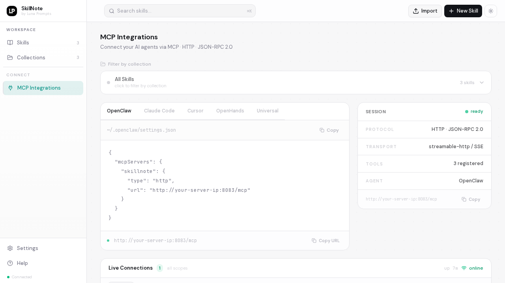
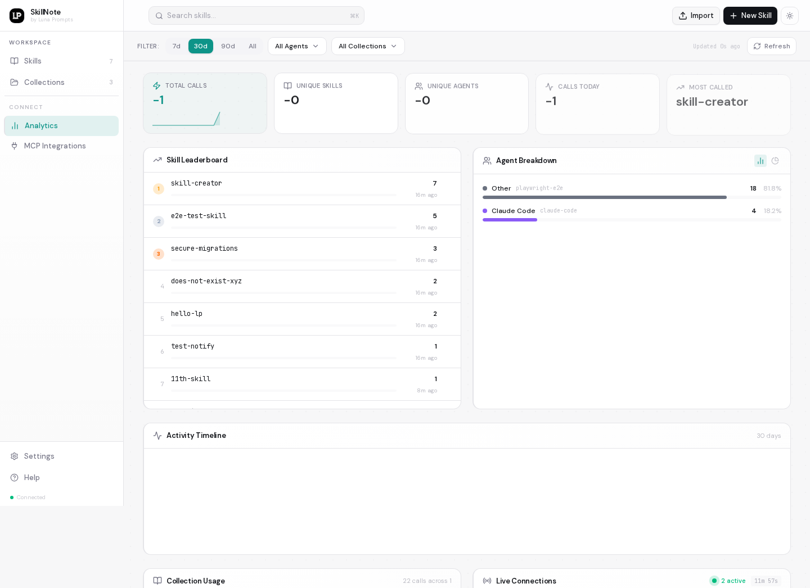

<p align="center">
  
</p>

<h1 align="center">SkillNote</h1>

<p align="center">
  <strong>The open-source skill registry for AI coding agents.</strong>
  <br />
  Create, manage, and distribute <code>SKILL.md</code> files, or connect any agent directly via MCP.
</p>

<p align="center">
  <a href="https://github.com/luna-prompts/skillnote/blob/master/LICENSE"></a>
  <a href="https://github.com/luna-prompts/skillnote"></a>
  <a href="https://github.com/luna-prompts/skillnote/issues"></a>
  <a href="https://discord.gg/GazU4amU6H"></a>
  
  
</p>

<p align="center">
  <a href="#quick-start">Quick Start</a> &nbsp;&middot;&nbsp;
  <a href="#mcp-server">MCP Server</a> &nbsp;&middot;&nbsp;
  <a href="#features">Features</a> &nbsp;&middot;&nbsp;
  <a href="#self-hosting">Self-Hosting</a> &nbsp;&middot;&nbsp;
  <a href="#contributing">Contributing</a>
</p>

<br />

---

## Why SkillNote?

AI coding agents like Claude Code, Cursor, and Codex use `SKILL.md` files to learn new capabilities. But managing these files is painful:

- They live scattered across `~/.claude/skills/`, `.cursor/skills/`, `.codex/skills/`
- No versioning, no search, no way to share across projects or teams
- Writing them from scratch means guessing what works

**SkillNote fixes this.** It's a self-hosted registry with a clean web UI, a CLI for one-command installs, and an MCP server that lets any agent connect directly with no file installation needed.

**Why self-hosted?** Enterprise workflows, proprietary codebases, and compliance-sensitive prompts contain institutional knowledge that shouldn't leave your infrastructure. SkillNote runs entirely on your machines. Your skills stay private, versioned, and accessible only to your team.

<p align="center">
  
</p>

---

## Quick Start

Make sure you have [Docker](https://docs.docker.com/get-docker/) and [Docker Compose](https://docs.docker.com/compose/install/) v2+ installed.

```bash
git clone https://github.com/luna-prompts/skillnote.git
cd skillnote
docker compose up --build -d
```

Four containers spin up:

| Service    | URL                        | What it does                            |
| ---------- | -------------------------- | --------------------------------------- |
| **Web**    | http://localhost:3000      | Next.js frontend                        |
| **API**    | http://localhost:8082      | FastAPI backend (auto-migrates + seeds) |
| **MCP**    | http://localhost:8083/mcp  | MCP server, skills as tools             |
| **DB**     | localhost:5432             | PostgreSQL 16                           |

Open **http://localhost:3000** and start creating skills.

> The backend auto-runs migrations and seeds a default skill (`skill-creator`) on first boot. No manual setup needed.

---

## Skills vs MCP: What's the Difference?

> Most people building AI agents hear about both and assume they're the same thing. They're not. Understanding the difference is what makes SkillNote click.

### Skills: reusable intelligence

A Skill is a reusable piece of knowledge injected into an agent's context: instructions, workflows, rules, examples. Think of it as a dynamic system prompt loaded on demand:

```
User message
    ↓
Agent picks the right Skill
    ↓
Injects SKILL.md content into the prompt
    ↓
LLM responds with that context
```

Skills improve **reasoning**. They teach the agent *how* to do something.

### MCP: context transport

[Model Context Protocol](https://modelcontextprotocol.io) is a standard for delivering context to agents: tools, APIs, documents, prompts. It improves **connectivity**. It doesn't care what the content is; it's the pipe.

```
Skills = HTML    (the content)
MCP    = HTTP    (the transport)
```

HTTP delivers HTML. But HTML isn't part of HTTP. Same relationship.

### How SkillNote combines both

**Version 1: local files:**
```
Agent reads skills/making-tea/SKILL.md from disk
```
Simple. Works offline. But skills go stale, drift across machines, and require manual installs.

**Version 2: MCP delivery (what SkillNote does):**
```
Agent  →  MCP  →  SkillNote  →  Skills DB
```
Every skill is exposed as an MCP tool. The agent discovers and calls them live: no files, no installs, always up to date. Update a skill in the Web UI and every connected agent gets the new version instantly.

> **Real-time push notifications.** When a skill is created, updated, or deleted the MCP server immediately pushes a `notifications/tools/list_changed` event to every connected agent over their open SSE stream. Compliant clients (Claude Code, OpenClaw, Cursor, …) re-fetch `tools/list` automatically — no reconnect, no polling, no restart required.

```
┌──────────┐     tools/list      ┌───────────────┐
│  Agent   │ ─────────────────▶  │  SkillNote    │
│          │ ◀─────────────────  │  MCP Server   │
│          │   [all your skills] │               │
│          │                     │  PostgreSQL   │
│          │  tools/call         │  LISTEN/      │
│          │ ─────────────────▶  │  NOTIFY       │
│          │ ◀─────────────────  │               │
│          │   skill content     │               │
│          │                     │               │
│          │ ◀─────────────────  │  push:        │
│          │  notifications/     │  tools/list   │
│          │  tools/list_changed │  _changed     │
└──────────┘  (SSE stream)       └───────────────┘
```

| | Local Skills | MCP Skills (SkillNote) |
|---|---|---|
| Updates | Manual (`git pull` / `npx install`) | Automatic: edit in UI, live instantly |
| Fragmentation | Different versions per machine | One source of truth |
| Discovery | Agent must know the file path | Agent discovers via `tools/list` |
| Sharing | Send files or links | Connect to the same server |
| Offline | Yes | Needs network |

---

## MCP Server

SkillNote exposes every skill as an MCP tool your agent can discover and call directly: no local files needed, no restart when skills change.

> **Every skill = one MCP tool.** The tool name is the skill slug, the description is what the agent reads to decide when to invoke it, and calling the tool returns the full `SKILL.md` content. Filter by collection to control which skills (tools) each agent sees.

**How it works:**
- Each skill becomes a tool: `name = slug`, `description = skill description`
- The agent uses the description to decide when to invoke the skill
- Calling the tool returns the full `SKILL.md` content
- Skills added, updated, or deleted in SkillNote trigger a `notifications/tools/list_changed` push to every connected agent — no reconnect needed

---

<details>
<summary><strong>Claude Code</strong></summary>

```bash
claude mcp add --transport http skillnote http://localhost:8083/mcp --scope user
```

Restart Claude Code, then run `/mcp` to confirm `skillnote` is listed.

</details>

<details>
<summary><strong>OpenClaw</strong></summary>

```bash
openclaw mcp add --transport http skillnote http://localhost:8083/mcp --scope user
```

Or add to `~/.openclaw/settings.json`:

```json
{
  "mcpServers": {
    "skillnote": {
      "type": "http",
      "url": "http://localhost:8083/mcp"
    }
  }
}
```

</details>

<details>
<summary><strong>OpenHands</strong></summary>

In the OpenHands settings, add a new MCP server under **MCP Servers**:

```json
{
  "mcpServers": {
    "skillnote": {
      "type": "http",
      "url": "http://localhost:8083/mcp"
    }
  }
}
```

</details>

<details>
<summary><strong>Codex (OpenAI)</strong></summary>

Add to your `codex.json` config:

```json
{
  "mcpServers": {
    "skillnote": {
      "type": "http",
      "url": "http://localhost:8083/mcp"
    }
  }
}
```

</details>

<details>
<summary><strong>Antigravity</strong></summary>

Add to your Antigravity MCP config:

```json
{
  "mcpServers": {
    "skillnote": {
      "type": "http",
      "url": "http://localhost:8083/mcp"
    }
  }
}
```

</details>

<details>
<summary><strong>Cursor</strong></summary>

Add to `~/.cursor/mcp.json` or via Settings → MCP:

```json
{
  "mcpServers": {
    "skillnote": {
      "type": "http",
      "url": "http://localhost:8083/mcp"
    }
  }
}
```

</details>

<details>
<summary><strong>Any other MCP-compatible agent</strong></summary>

Any agent that supports the MCP HTTP transport can connect:

```
http://localhost:8083/mcp
```

</details>

### Filter skills by collection

Use environment variables to serve only a subset of skills to a specific agent:

```bash
SKILLNOTE_MCP_FILTER_COLLECTIONS=devops,security docker compose up -d mcp
```

This is useful for scoping what different teams or agents can see.

### MCP Integrations UI

The **MCP Integrations** page (sidebar → Connect → MCP Integrations) gives you ready-to-copy config snippets for every supported agent, a scope selector to generate collection-filtered URLs, and a live connection monitor that shows every connected agent — its name, version, IP, call count, and session duration — updating every 5 seconds.

<p align="center">
  
</p>

---

## Features

### Skill Editor
A Notion-style WYSIWYG editor powered by Tiptap. Write in rich text or switch to raw markdown. Paste a raw `SKILL.md` file and it auto-extracts the name, description, and body from the frontmatter.

<p align="center">
  
</p>

### Version History
Every save creates a snapshot. Browse the full history, compare versions, and restore any previous state with one click. Published versions use semantic versioning (`1.0.0`, `1.1.0`, ...) and are distributed as checksummed ZIP bundles.

<p align="center">
  
</p>

### Analytics
Track how your skills are used across every connected agent. The Analytics dashboard shows total calls, unique skills invoked, active agents, a skill leaderboard, agent breakdown by client, an activity timeline, collection usage, and a live connections panel — all filterable by 7d / 30d / 90d / all-time.

<p align="center">
  
</p>

### Collections
Organise skills into collections. Filter, search, and browse by category. Add or remove skills from any collection with inline confirmation.

### Multi-Agent Install
Install skills as local files to any AI coding agent from the web UI or CLI. Supported agents:

| Agent       | Install Path                                |
| ----------- | ------------------------------------------- |
| Claude Code | `~/.claude/skills/<skill>/SKILL.md`         |
| Cursor      | `.cursor/skills/<skill>/SKILL.md`           |
| Codex       | `.codex/skills/<skill>/SKILL.md`            |
| OpenClaw    | `~/.openclaw/skills/<skill>/SKILL.md`       |
| OpenHands   | `~/.openhands/skills/<skill>/SKILL.md`      |
| Windsurf    | `.windsurf/skills/<skill>/SKILL.md`         |
| Universal   | `.skills/<skill>/SKILL.md`                  |

---

## SKILL.md Format

Every skill is a Markdown file with YAML frontmatter:

```markdown
---
name: pdf-extractor
description: Extract text and tables from PDF files. Use when the user mentions PDFs, scanned documents, or form extraction.
---

# PDF Extractor

When the user provides a PDF file:

1. Use `pdftotext` to extract raw text
2. Identify tables and format them as markdown
3. Preserve headings and document structure
```

---

## Self-Hosting

### System Requirements

SkillNote is lightweight. Here's what it uses on a typical machine at idle:

| Container    | Image size | RAM (idle) | RAM (under load) |
| ------------ | ---------- | ---------- | ---------------- |
| **Web**      | ~302 MB    | ~37 MB     | ~60 MB           |
| **API**      | ~456 MB    | ~71 MB     | ~120 MB          |
| **MCP**      | ~456 MB    | ~104 MB    | ~160 MB          |
| **Postgres** | ~663 MB    | ~38 MB     | ~80 MB           |
| **Total**    | ~1.9 GB    | **~250 MB**| **~420 MB**      |

> The API and MCP images share base layers — the combined pull is ~600 MB, not 912 MB.

**Minimum recommended specs:**
- CPU: 1 core (2+ recommended for MCP-heavy workloads)
- RAM: 512 MB free
- Disk: 2 GB for images + space for skill bundles (5 MB each by default)

**Disk usage over time:**
- Each published skill version creates a ZIP bundle (≤ 5 MB by default)
- PostgreSQL data grows slowly — a typical install with 100 skills is < 10 MB
- Logs are written to stdout (captured by Docker); no files accumulate on disk

To check live resource usage at any time:

```bash
docker stats
```

### Docker Compose (recommended)

```bash
git clone https://github.com/luna-prompts/skillnote.git
cd skillnote
docker compose up --build -d
```

#### Custom host or port

```bash
SKILLNOTE_HOST=192.168.1.100 SKILLNOTE_API_PORT=9000 docker compose up --build -d
```

#### Stop & reset

```bash
docker compose down          # Stop (keeps data)
docker compose down -v       # Stop + wipe database
```

### Local Development

Run the backend in Docker, frontend with hot-reload:

```bash
# Terminal 1: Backend + MCP
docker compose up --build -d postgres api mcp
curl http://localhost:8082/health   # Wait for {"status":"ok"}

# Terminal 2: Frontend
npm install
npm run dev                         # http://localhost:3000
```

### Environment Variables

| Variable                          | Default                 | Description                              |
| --------------------------------- | ----------------------- | ---------------------------------------- |
| `SKILLNOTE_HOST`                  | `localhost`             | Host IP or domain (CORS + frontend URL)  |
| `SKILLNOTE_API_PORT`              | `8082`                  | Host port for the API                    |
| `SKILLNOTE_MCP_PORT`              | `8083`                  | Host port for the MCP server             |
| `SKILLNOTE_DATABASE_URL`          | *(set in compose)*      | PostgreSQL connection string             |
| `SKILLNOTE_BUNDLE_STORAGE_DIR`    | `/app/data/bundles`     | Where versioned ZIP bundles are stored   |
| `SKILLNOTE_MAX_BUNDLE_SIZE_BYTES` | `5242880`               | Max bundle upload size (5 MB)            |
| `SKILLNOTE_CORS_ORIGINS`          | *(auto from host)*      | Comma-separated CORS origins             |
| `NEXT_PUBLIC_API_BASE_URL`        | `http://localhost:8082` | Frontend API endpoint                    |
| `SKILLNOTE_MCP_FILTER_COLLECTIONS`| *(all)*                 | Comma-separated collections to expose via MCP |

---

## Tech Stack

| Layer      | Technology                                              |
| ---------- | ------------------------------------------------------- |
| Frontend   | Next.js 16, React 19, TypeScript, Tailwind CSS 4, Tiptap |
| Backend    | Python 3.12, FastAPI, SQLAlchemy 2, Alembic, Pydantic 2 |
| MCP Server | Python 3.12, FastMCP                                    |
| Database   | PostgreSQL 16                                           |
| CLI        | Node.js, TypeScript, Commander.js                       |
| Infra      | Docker, Docker Compose                                  |

---

## References

- [Claude Code Skills](https://platform.claude.com/docs/en/agents-and-tools/agent-skills/overview) - Anthropic's official skills documentation
- [Model Context Protocol](https://modelcontextprotocol.io) - MCP specification
- [AgentSkills.io](https://agentskills.io/home) - The skills ecosystem
- [Codex Skills](https://developers.openai.com/codex/skills/) - OpenAI Codex skills reference
- [Antigravity Skills](https://antigravity.google/docs/skills) - Google Antigravity skills documentation
- [OpenHands Skills](https://docs.openhands.dev/overview/skills) - OpenHands skills overview

---

## Star Us

If you find SkillNote useful, please consider giving it a star on GitHub. It helps others discover the project and motivates us to keep improving it.

<p align="center">
  <a href="https://github.com/luna-prompts/skillnote"></a>
</p>

---

## Contributing

Contributions are welcome! Here's how:

1. Fork the repository
2. Create a feature branch (`git checkout -b feat/my-feature`)
3. Commit your changes (`git commit -m 'feat: add my feature'`)
4. Push to the branch (`git push origin feat/my-feature`)
5. Open a Pull Request

Please follow [Conventional Commits](https://www.conventionalcommits.org/) for commit messages.

Join us on [Discord](https://discord.gg/GazU4amU6H) to discuss ideas, get help, or just hang out.

---

## License

MIT &copy; [Luna Prompts](https://github.com/luna-prompts)

---

<p align="center">
  Made with ❤️ by <a href="https://github.com/luna-prompts"><strong>Luna Prompts</strong></a>
</p>
