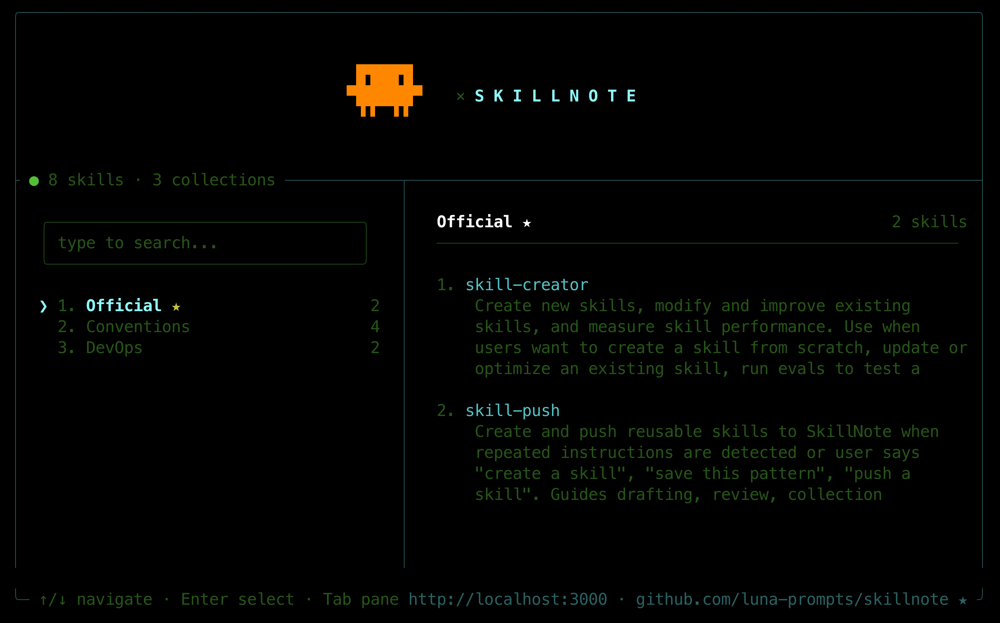
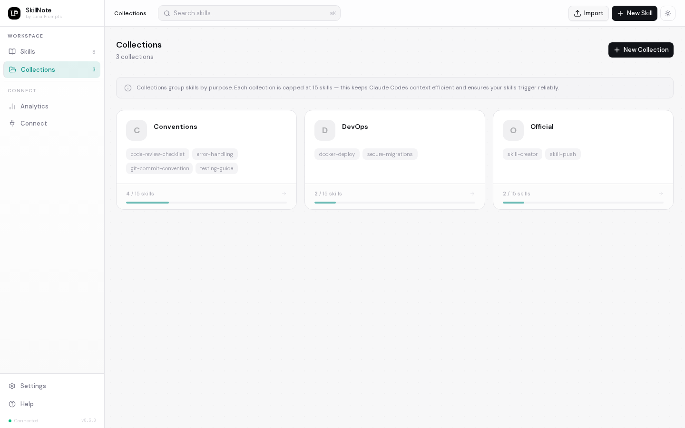
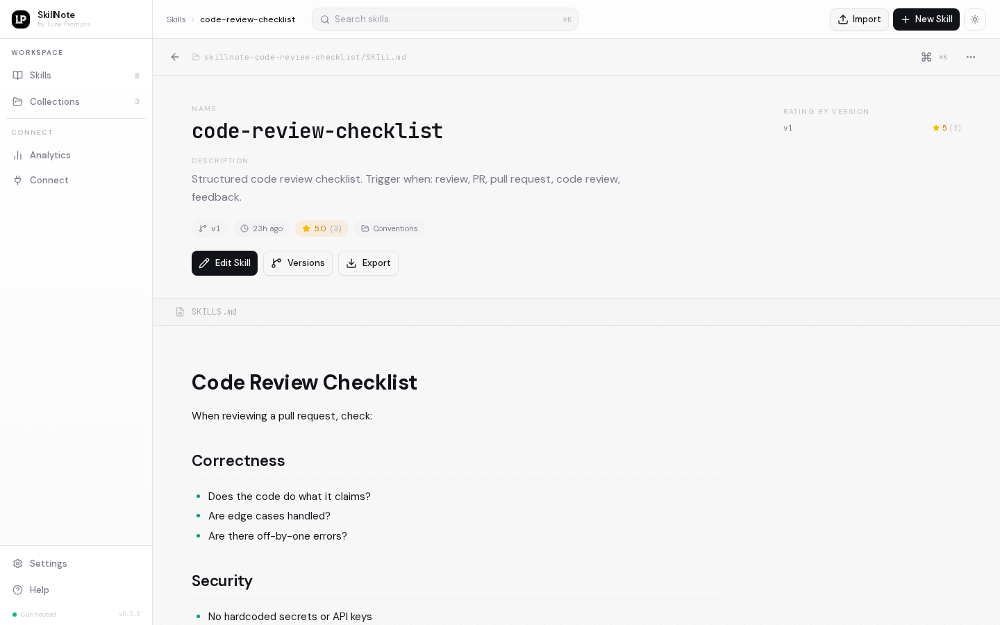

<p align="center">
  
</p>

<h1 align="center">S K I L L N O T E</h1>

<p align="center">
  <strong>Self-hosted skill registry for AI coding agents.</strong>
  <br />
  Create, version, and share <code>SKILL.md</code> files across your team. Stop copy-pasting skills between repos.
</p>

<p align="center">
  <a href="https://github.com/luna-prompts/skillnote/blob/master/LICENSE"></a>
  <a href="https://github.com/luna-prompts/skillnote"></a>
  <a href="https://github.com/luna-prompts/skillnote/issues"></a>
  <a href="https://discord.gg/GazU4amU6H"></a>
  
  
</p>

<br />

<p align="center">
  
</p>

<p align="center">
  <a href="#the-problem">The Problem</a> &middot;
  <a href="#quick-start">Quick Start</a> &middot;
  <a href="#why-collections">Collections</a> &middot;
  <a href="#agent-reviews">Reviews</a> &middot;
  <a href="#live-sync">Live Sync</a> &middot;
  <a href="#the-web-ui">Web UI</a> &middot;
  <a href="#built-on-claude-codes-native-apis">How It Works</a>
</p>

---

## The Problem

Claude Code skills are powerful but managing them breaks down fast.

**Skills stop triggering.** Claude Code shares [~8,000 characters](https://docs.anthropic.com/en/docs/claude-code/skills) across all active skill descriptions. Past that limit, descriptions get silently truncated. Skills with good documentation get cut first. The system prompt tells Claude to never use skills that aren't listed, so truncated skills are both invisible and explicitly forbidden. ([#13343](https://github.com/anthropics/claude-code/issues/13343), [#40121](https://github.com/anthropics/claude-code/issues/40121))

**Skills are scattered everywhere.** They live in `~/.claude/skills/` with no versioning, no search, and no way to share. Someone clones your project and has no idea which skills it depends on. There's no `package.json` for skills. ([#27113](https://github.com/anthropics/claude-code/issues/27113))

**Skills can't be shared across a team.** Updating a shared skill means downloading, editing, re-zipping, and hoping the upload works for everyone. New teammates discover missing skills only when something breaks. Tribal knowledge walks out the door when someone leaves.

**Private skills have nowhere to go.** Internal deploy procedures, proprietary API patterns, compliance workflows, infra runbooks. These encode institutional knowledge that can't live in a public repo or third-party registry. They need to stay on your infrastructure.

**SkillNote** is a self-hosted registry that solves all of this. A private registry for skills that can't leave your network. Collections to load only the skills you need for each session. A plugin that syncs the selected collection to Claude Code at launch and keeps it updated throughout the session. And a feedback loop where agents rate skills after use.

Your skills. Your servers. Your rules.

---

## Quick Start

```bash
git clone https://github.com/luna-prompts/skillnote.git
cd skillnote
./install.sh
```

The install script builds and starts all containers, waits for health checks, and prints the Claude Code plugin command when ready.

Then connect Claude Code:

```bash
curl -sf http://localhost:8082/setup | bash
source ~/.zshrc
```

Now run `claude` in any project. SkillNote picks up your skills automatically.

---

## Why Collections

Claude Code has a hard context budget for skills. With 15+ skills loaded, descriptions get truncated and [skills stop triggering reliably](https://github.com/anthropics/claude-code/issues/13343). You can't use all your skills at once. You have to pick.

Collections solve this. Instead of cluttering Claude's context with 30+ skills (half truncated), you scope 10 to 15 relevant skills per project.

<p align="center">
  
</p>

Your frontend project gets React hooks and testing patterns. Your API project gets error handling and deploy conventions. Same registry, different active sets. No context wasted.

**How it works:**

- Create collections in the web UI: `Conventions`, `DevOps`, `Frontend`
- Each collection holds up to **15 skills** (the sweet spot before truncation kicks in)
- When you run `claude`, the plugin shows a picker. Select a collection for this project
- Saved in `.skillnote.json` so it persists across sessions
- If your folder name matches a collection, the plugin recommends it automatically

> Read more about Claude Code's skill description budget in the [official documentation](https://docs.anthropic.com/en/docs/claude-code/skills).

---

## Agent Reviews

Most skill setups are fire and forget. You write a skill, hope it triggers, and never hear back. 73% of community skills score below 60/100 in audits because nobody knows what's working.

SkillNote closes the feedback loop. After applying a skill, Claude rates it 1 to 5 and describes what it did. Every skill page shows reviews with star distribution, individual cards, agent names, versions, and timestamps.

<p align="center">
  
</p>

This tells you which skills are actually being used, which ones work well, and how performance changes across versions. Skills get better over time because you have real signal, not guesswork.

---

## Live Sync

Edit a skill in the browser and every running Claude Code session picks up the change within 60 seconds. No restarts, no manual copying, no "did you pull the latest skills?"

The plugin runs a background sync on every prompt. When it detects changes on the server, it updates the local `SKILL.md` files and Claude hot-reloads them mid-session. This works across your whole team. One person updates a skill, everyone gets it.

Onboarding is instant. A new teammate runs the setup command, picks a collection, and has every skill the team has built. No Slack messages asking "where's the deploy checklist?" No discovering missing skills only when something breaks.

---

## Skill Push

When Claude notices you repeating the same instruction, it offers to turn it into a skill. The skill gets pushed to SkillNote and syncs to every connected agent within 60 seconds.

```
User: "use pnpm not npm"  (3rd time)
Claude: "Want me to create a skill for this?"
        drafts it, you review, pick a collection, published.
```

Your team's knowledge compounds. What one person corrects once becomes a skill everyone benefits from. Tribal knowledge stops walking out the door.

---

## The Web UI

### Dashboard & Editor

Browse all skills with search, collection filters, and ratings at a glance. Edit with a Notion-style WYSIWYG editor or raw markdown. Import existing `SKILL.md` files with drag and drop.

<p align="center">
  
</p>

### Analytics

Track which skills are used, how often, and by which agents. See call counts, average ratings, agent breakdown, and activity timeline. Filter by time range, agent, or collection.

<p align="center">
  
</p>

### Version History

Every save creates a snapshot. Browse, compare, and restore any previous version in one click.

<p align="center">
  
</p>

---

## Built on Claude Code's Native APIs

SkillNote isn't a wrapper or a workaround. It's built directly on [Claude Code's plugin system](https://docs.anthropic.com/en/docs/claude-code/plugins), [hooks](https://docs.anthropic.com/en/docs/claude-code/hooks), and [skill format](https://docs.anthropic.com/en/docs/claude-code/skills). Every feature uses the official APIs, so the experience feels native, not bolted on.

### Six Lifecycle Hooks

Most tools use one or two hooks. SkillNote uses all six to keep skills current, track usage, and preserve context through compaction and subagent spawning.

```
┌──────────────────────────────────────────────────────┐
│                                                      │
│   SkillNote Server (Docker)                          │
│                                                      │
│   Web UI        REST API       PostgreSQL            │
│   :3000         :8082          (storage + notify)    │
│                                                      │
└────────────────────┬─────────────────────────────────┘
                     │
                  REST API
                     │
┌────────────────────┴─────────────────────────────────┐
│                                                      │
│   SkillNote Plugin (on your machine)                 │
│                                                      │
│   SessionStart      Sync all skills on launch        │
│   UserPromptSubmit  Background re-sync every 60s     │
│   PostToolUse       Track which skills get used      │
│   PostCompact       Re-inject context after compact  │
│   SubagentStart     Share context with subagents     │
│   Stop              Prompt agent to rate skills      │
│                                                      │
│   Writes to: ~/.claude/skills/skillnote-*/SKILL.md   │
│   Supports:  allowed-tools, context, effort, model   │
│                                                      │
└──────────────────────────────────────────────────────┘
```

### Full Frontmatter Support

Skills are written as local `SKILL.md` files, not piped through an abstraction layer. Every [Claude Code frontmatter feature](https://docs.anthropic.com/en/docs/claude-code/skills) works:

- **`allowed-tools`** to restrict which tools a skill can use
- **`context: fork`** to isolate skill execution in a separate context
- **`effort`** to control how much reasoning the agent applies
- **`model`** to pin a skill to a specific model

These features only work with local `SKILL.md` files, not with MCP tools or remote APIs. That's why SkillNote syncs to disk instead of serving skills over a network protocol.

### Non-blocking by Design

Only `SessionStart` blocks (for ~1 second to sync). Every other hook runs asynchronously. You never wait for SkillNote.

---

## Coming Soon

SkillNote is built for Claude Code today. Native plugins for other agents are on the roadmap.

| Agent | Status |
| --- | --- |
| **Claude Code** | Supported |
| **Cursor** | Planned |
| **Codex CLI** | Planned |
| **OpenClaw** | Planned |
| **Antigravity** | Planned |
| **OpenHands** | Planned |

Want to help build an adapter? [Open an issue](https://github.com/luna-prompts/skillnote/issues) or join us on [Discord](https://discord.gg/GazU4amU6H).

---

## SKILL.md Format

```markdown
---
name: pdf-extractor
description: Extract text and tables from PDF files. Use when the user mentions PDFs or scanned documents.
collections: [data, documents]
allowed-tools: Read Write Bash(pdftotext *)
context: fork
---

# PDF Extractor

When the user provides a PDF file:
1. Use `pdftotext` to extract raw text
2. Identify tables and format them as markdown
3. Preserve headings and document structure
```

---

## Tech Stack

| Layer | Technology |
| --- | --- |
| Frontend | Next.js 16, React 19, TypeScript, Tailwind CSS 4, Tiptap |
| Backend | Python 3.12, FastAPI, SQLAlchemy 2, Alembic |
| Plugin | Bash, Python, Claude Code Plugin API |
| Database | PostgreSQL 16 |
| Infra | Docker Compose |

---

## Contributing

1. Fork the repo
2. `git checkout -b feat/my-feature`
3. Commit with [Conventional Commits](https://www.conventionalcommits.org/)
4. Push and open a PR

Join us on [Discord](https://discord.gg/GazU4amU6H).

---

## License

MIT &copy; [Luna Prompts](https://github.com/luna-prompts)

---

<p align="center">
  <br />
  <a href="https://github.com/luna-prompts/skillnote"></a>
  <br /><br />
  Built with ❤️ by <a href="https://github.com/luna-prompts"><strong>Luna Prompts</strong></a>
</p>
