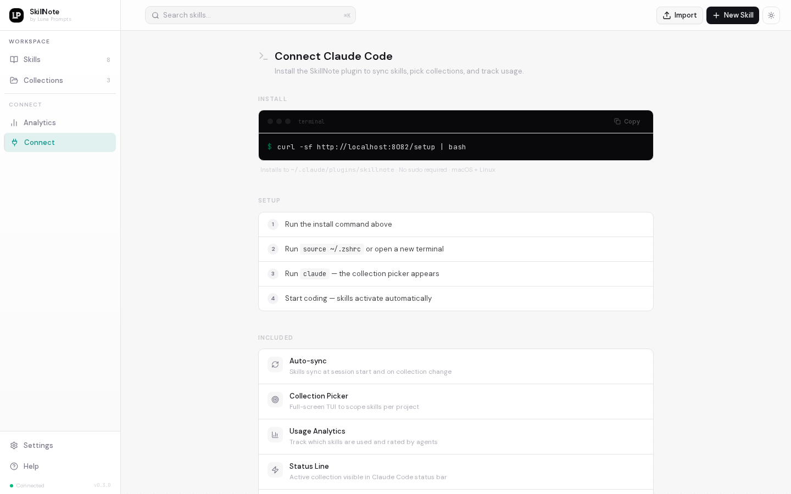
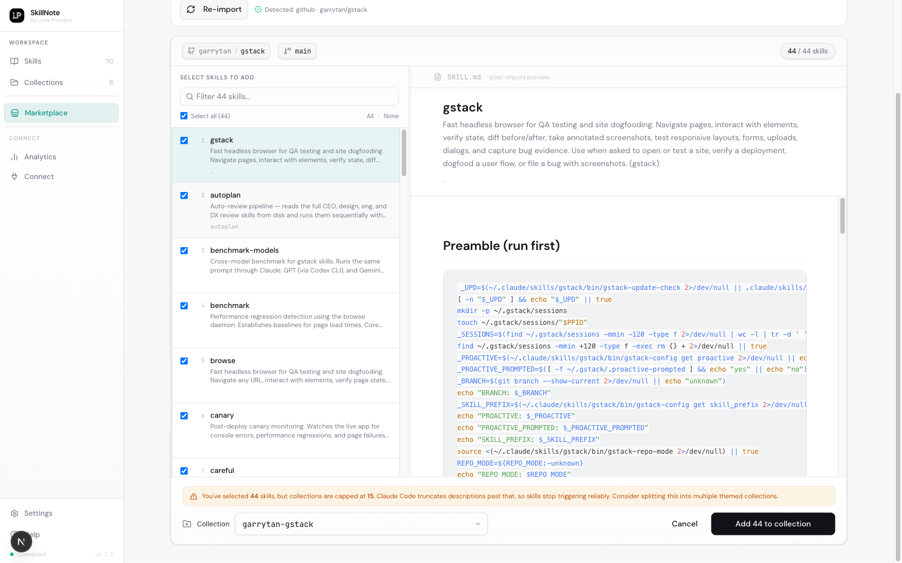

<p align="center">
  
</p>

<h1 align="center">S K I L L N O T E</h1>

<p align="center">
  <strong>Self-hosted skill registry for AI agents.</strong>
  <br />
  Create, version, and share <code>SKILL.md</code> files across your team. Native plugins for Claude Code and OpenClaw. Stop copy-pasting skills between repos.
</p>

<p align="center">
  <a href="https://github.com/luna-prompts/skillnote/blob/master/LICENSE"></a>
  <a href="https://github.com/luna-prompts/skillnote"></a>
  <a href="https://github.com/luna-prompts/skillnote/issues"></a>
  <a href="https://clawhub.ai/latentloop07/skillnote"></a>
  <a href="https://discord.gg/GazU4amU6H"></a>
  
  
</p>

<br />

<p align="center">
  
</p>

<p align="center">
  <a href="#the-problem">The Problem</a> &middot;
  <a href="#quick-start">Quick Start</a> &middot;
  <a href="#why-collections">Collections</a> &middot;
  <a href="#marketplace">Marketplace</a> &middot;
  <a href="#agent-reviews">Reviews</a> &middot;
  <a href="#live-sync">Live Sync</a> &middot;
  <a href="#openclaw-integration">OpenClaw</a> &middot;
  <a href="#the-web-ui">Web UI</a> &middot;
  <a href="#how-it-works">How It Works</a>
</p>

---

## The Problem

Claude Code skills are powerful but managing them breaks down fast.

**Skills stop triggering.** Claude Code shares [~8,000 characters](https://docs.anthropic.com/en/docs/claude-code/skills) across all active skill descriptions. Past that limit, descriptions get silently truncated. Skills with good documentation get cut first. The system prompt tells Claude to never use skills that aren't listed, so truncated skills are both invisible and explicitly forbidden. ([#13343](https://github.com/anthropics/claude-code/issues/13343), [#40121](https://github.com/anthropics/claude-code/issues/40121))

**Skills are scattered everywhere.** They live in `~/.claude/skills/` with no versioning, no search, and no way to share. Someone clones your project and has no idea which skills it depends on. There's no `package.json` for skills. ([#27113](https://github.com/anthropics/claude-code/issues/27113))

**Skills can't be shared across a team.** Updating a shared skill means downloading, editing, re-zipping, and hoping the upload works for everyone. New teammates discover missing skills only when something breaks. Tribal knowledge walks out the door when someone leaves.

**Private skills have nowhere to go.** Internal deploy procedures, proprietary API patterns, compliance workflows, infra runbooks. These encode institutional knowledge that can't live in a public repo or third-party registry. They need to stay on your infrastructure.

**SkillNote** is a self-hosted registry that solves all of this. A private registry for skills that can't leave your network. Collections to scope what loads when context is tight (relevant for Claude Code and other harnesses that pre-load skill metadata). Native plugins that sync to your agent at launch and keep skills hot-reloading throughout the session. And a feedback loop where agents rate skills after use.

Your skills. Your servers. Your rules.

---

## Quick Start

Spin up the registry locally:

```bash
git clone https://github.com/luna-prompts/skillnote.git
cd skillnote
./install.sh
```

The install script builds and starts all containers, waits for health checks, and prints the connect command when ready.

Then wire up your AI agent:

<details>
<summary><b>Connect Claude Code</b></summary>

#### Recommended: one-liner

End-to-end from a fresh machine (clone, start backend, connect Claude Code):

```bash
git clone https://github.com/luna-prompts/skillnote.git
cd skillnote
./install.sh
curl -sf http://localhost:8082/setup/agent | bash -s -- --agent claude-code
source ~/.zshrc
```

`./install.sh` prints which `setup/agent` command to run for each agent home it detects on your machine, so you can also stop after step 3 and follow its instructions instead of pasting the curl line above.

The same `setup/agent` endpoint works for any harness; pass `--agent claude-code` or `--agent openclaw`. Run `claude` in any project; SkillNote picks up your skills automatically and the collection picker appears on first launch.

#### Or, paste this prompt to Claude Code

Works from a totally fresh state (Claude Code installs both the backend and the plugin itself):

```text
I want you to install SkillNote on my machine and wire it into this Claude Code session.
SkillNote is a self-hosted skill registry. I want it running locally at http://localhost:8082.

Do the full install yourself. Don't ask me to run commands.

1. Check if the SkillNote backend is already running:
   - Try: curl -sf http://localhost:8082/health
   - If it responds, skip to step 2.
   - If not, clone the repo and start the backend yourself:
       git clone https://github.com/luna-prompts/skillnote.git ~/skillnote
       cd ~/skillnote && ./install.sh
     ./install.sh builds containers, runs migrations, seeds, and waits for health.
     Don't move on until http://localhost:8082/health responds with ok.

2. Check if the Claude Code plugin is already installed:
   - Look for ~/.claude/plugins/skillnote/
   - If it exists, skip to step 4.

3. If not installed, run the official plugin installer:
   - curl -sf http://localhost:8082/setup | bash

4. Reload the shell so the plugin is picked up:
   - source ~/.zshrc (or ~/.bashrc)

5. Confirm it works:
   - Run: claude --version
   - List the installed plugin: ls ~/.claude/plugins/skillnote/
   - Tell me what collection picker options you see when running `claude`.

Don't ask for confirmation between steps. Just run the commands and report results.
```

#### What gets installed

| Path | Role |
| ---- | ---- |
| `~/.claude/plugins/skillnote/` | The plugin code: hooks, slash commands, status line, collection picker |
| `.skillnote.json` (per project) | Pinned active collection (survives across sessions) |

</details>

<details>
<summary><b>Connect OpenClaw</b></summary>

Published on clawhub as [`skillnote`](https://clawhub.ai/latentloop07/skillnote).

```bash
clawhub install skillnote
```

For the default `localhost:8082` setup, that's the whole install. If the backend isn't running, the skill auto-bootstraps it (clones this repo + runs `./install.sh`) on first sync.

<details>
<summary>Non-default host</summary>

```bash
export SKILLNOTE_BASE_URL="http://your-server:8082"
clawhub install skillnote
echo 'export SKILLNOTE_BASE_URL="http://your-server:8082"' >> ~/.zshrc
```

clawhub doesn't accept a host argument; the env var is how you tell the skill where to look (resolution order: env → config file → default `localhost:8082`).

</details>

<details>
<summary>Other ways to install</summary>

Three alternatives to `clawhub install skillnote`. Each is for a specific situation; pick the one that matches yours.

**1. Paste-prompt install — when you'd rather not use the terminal.**

Open the Connect page in your SkillNote web UI → OpenClaw tab → "Copy prompt", then paste the result into a fresh OpenClaw session. The agent runs the install itself (calls `clawhub install skillnote` under the hood, configures the URL, runs the first sync). You still need clawhub available; this just means you don't have to type the command.

**2. Curl installer — when you don't want clawhub at all.**

Pulls the bundle directly from your SkillNote backend, no clawhub required. Use this for CI, scripted installs, or if you'd rather not pull from a third-party registry.

```bash
git clone https://github.com/luna-prompts/skillnote.git && cd skillnote && ./install.sh
curl -sf http://localhost:8082/setup/agent | bash -s -- --agent openclaw
```

**3. Manual install — when you want full step-by-step control (air-gapped, custom layout, debugging).**

Backend must already be reachable.

```bash
mkdir -p ~/.openclaw/skills ~/.openclaw/skillnote
curl -sf http://localhost:8082/v1/openclaw-bundle.zip -o /tmp/skillnote.zip
unzip -qo /tmp/skillnote.zip -d ~/.openclaw/skills/ && rm /tmp/skillnote.zip
echo '{"host":"http://localhost:8082","user_id":"openclaw-main"}' > ~/.openclaw/skillnote/config.json
chmod +x ~/.openclaw/skills/skillnote/sync.sh
# Restart OpenClaw to pick up the skill.
```

</details>

#### What gets installed

| Path | Role |
| ---- | ---- |
| `~/.openclaw/skills/skillnote/` | The skill itself plus `sync.sh` and `log-watcher.py` |
| `~/.openclaw/skills/sn-*/` | Per-skill mirrors synced from your registry every 60s |
| `~/.openclaw/skills/skillnote/config.json` | Your registry URL and agent ID |
| `~/.openclaw/workspace/AGENTS.md` | Persistent `<skillnote v1>` block (keeps the registry active across sessions) |

</details>

---

## Why Collections

Some agents load every available skill's description into context at session start. Claude Code is the canonical case: when you launch `claude`, every active skill's name and description gets baked into the system prompt so the model can decide what to invoke. Past [~8,000 characters](https://docs.anthropic.com/en/docs/claude-code/skills) (roughly 15 skills), descriptions silently truncate, and [skills stop triggering reliably](https://github.com/anthropics/claude-code/issues/13343). You can't keep everything active at once. You have to pre-select.

Collections are SkillNote's answer. Instead of cluttering the context with 30+ skills (half truncated), you scope 10 to 15 relevant skills per project. The picker appears when you run `claude`:

<p align="center">
  
</p>

Your frontend project gets React hooks and testing patterns. Your API project gets error handling and deploy conventions. Same registry, different active sets. No context wasted.

<p align="center">
  
</p>

**How it works:**

- Create collections in the web UI (e.g., `Conventions`, `DevOps`, `Frontend`)
- Each collection holds up to **15 skills** (the sweet spot before truncation kicks in)
- When you run `claude`, the plugin shows a picker. Select a collection for this project
- Saved in `.skillnote.json` so it persists across sessions
- If your folder name matches a collection, the plugin recommends it automatically

> Long-running agents that pick skills at runtime instead of preloading them (OpenClaw, for example) sync the full catalog and choose per task. The 15-skill ceiling doesn't apply, and collection scoping is a no-op for them. The trade-off shifts from "fit everything in the system prompt" to "search the right thing per task", which is its own scaling problem; see [`docs/superpowers/plans/2026-05-02-skill-picking-at-scale.md`](docs/superpowers/plans/2026-05-02-skill-picking-at-scale.md) for how that picking-at-scale work is tracked.

> Background on Claude Code's skill description budget is in the [official documentation](https://docs.anthropic.com/en/docs/claude-code/skills).

---

## Marketplace

The Claude Code community has already curated hundreds of `SKILL.md` files in public GitHub repos. SkillNote's **Marketplace** tab pulls them straight into your self-hosted registry with full provenance, per-skill selection, and safe upsert on re-install.

**Paste anything GitHub understands:**

- Shorthand: `garrytan/gstack`, `anthropics/skills`
- Full repo URL: `https://github.com/obra/superpowers-marketplace`
- Tree URL to a subfolder: `https://github.com/obra/superpowers/tree/main/skills`
- Claude Code marketplace manifest (`anthropic.json`)

Try any of these in the app: Garry Tan's 23-skill YC-flavored [`gstack`](https://github.com/garrytan/gstack), Jesse Vincent's [`superpowers`](https://github.com/obra/superpowers) agentic skills framework, or Anthropic's [`anthropics/skills`](https://github.com/anthropics/skills).

The inspector shallow-clones with sparse checkout (scoped to a subfolder if given), scans every `SKILL.md`, validates YAML frontmatter, and opens a full-page workspace before anything lands in your library.

<p align="center">
  
</p>

In the workspace you filter and pick exactly which skills to install, preview each `SKILL.md` rendered exactly as it will appear post-install, and choose an existing collection from a Jira-style combobox with fuzzy match or create a new one inline (the inferred slug is tagged **Recommended**). An amber warning fires if you exceed the 15-skill cap, with a one-click suggestion to split into themed collections.

---

## Agent Reviews

Most skill setups are fire and forget. You write a skill, hope it triggers, and never hear back.

SkillNote closes the feedback loop. After applying a skill, the agent (Claude Code or OpenClaw) rates it 1 to 5 and describes what it did. Every skill page shows reviews with star distribution, individual cards, agent names, versions, and timestamps. OpenClaw additionally posts a `linked_usage_id` on each rating so the registry can join the comment back to the specific task it was about.

<p align="center">
  
</p>

This tells you which skills are actually being used, which ones work well, and how performance changes across versions. Skills get better over time because you have real signal, not guesswork.

---

## Live Sync

Edit a skill in the browser and every running Claude Code or OpenClaw session picks up the change within 60 seconds. No restarts, no manual copying, no "did you pull the latest skills?"

For Claude Code: the plugin runs a background sync on every prompt. When it detects changes on the server, it updates the local `SKILL.md` files and Claude hot-reloads them mid-session.

For OpenClaw: a `sync.sh` script runs on a 60s throttle, fetches the catalog, writes per-skill mirrors to `~/.openclaw/skills/sn-*/`, and spawns a background `log-watcher.py` daemon that tracks which skills the agent reads.

Both work across your whole team. One person updates a skill, everyone gets it. Onboarding is instant: a new teammate runs the setup command, picks a collection (Claude Code) or pastes the agent prompt (OpenClaw), and has every skill the team has built. No Slack messages asking "where's the deploy checklist?" No discovering missing skills only when something breaks.

---

## Skill Push

When the agent (Claude Code today; OpenClaw on the roadmap) notices you repeating the same instruction, it offers to turn it into a skill. The skill gets pushed to SkillNote and syncs to every connected agent within 60 seconds.

```
User: "use pnpm not npm"  (3rd time)
Claude: "Want me to create a skill for this?"
        drafts it, you review, pick a collection, published.
```

Your team's knowledge compounds. What one person corrects once becomes a skill everyone benefits from. Tribal knowledge stops walking out the door.

---

## OpenClaw Integration

SkillNote ships a native integration for [OpenClaw](https://github.com/openclaw/openclaw), the open-source chat-first AI agent runtime. Install steps live in the [Quick Start](#quick-start) collapsible above; this section is about what you actually get.

Once installed, your OpenClaw agent:

- **Reads the catalog before each task.** `sync.sh` keeps `~/.openclaw/skills/sn-*/` in step with the registry on a 60s throttle, and the AGENTS.md graft tells the agent to scan synced skill descriptions before responding.
- **Picks 0 to 5 skills per task.** The agent reads frontmatter descriptions, picks the best matches, and reads only those full SKILL.md files (works well up to ~15-20 skills; the resolver subagent for larger catalogs is on the roadmap, see `docs/superpowers/plans/2026-05-02-skill-picking-at-scale.md`).
- **Logs reads + applications.** A background `log-watcher.py` daemon parses session JSONL and posts a `skill-used` event each time the agent opens an `sn-*/SKILL.md`. The agent itself posts `/v1/openclaw/usage` events (with `outcome: completed | failed | abandoned`) after applying skills. Reads and applications stay distinguishable in analytics.
- **Rates skills in the same turn.** Each synced skill has a pre-filled rating curl command in its body. The agent runs it (with `linked_usage_id` correlating the rating to the specific task) when a skill clearly helped or failed.

The single `skillnote` clawhub package includes:

- **`SKILL.md`**: always-injected instructions for setup, picking, logging, rating
- **`sync.sh`**: catalog sync, daily self-update check, AGENTS.md graft (idempotent, opt-out aware)
- **`log-watcher.py`**: analytics daemon (PID-guarded, mtime-based dedup across daemon restarts, multi-agent attribution from the file path)
- **`install-backend.sh`**: bootstrap script that clones the repo and runs Docker compose if no SkillNote backend exists on `localhost:8082`

No subagent or LLM resolver step. OpenClaw reads synced files directly via its native skill system.

### What you see

- **Settings, OpenClaw**: live connection status. Green dot means the agent can reach your registry.
- **Analytics**: usage events appear here as the agent works, broken out by agent name (multi-agent OpenClaw setups show separate identities).
- **Skill pages, Reviews tab**: agent observations (`agent_observation`, `agent_issue`, `agent_success_note`, `agent_patch_suggestion`, `agent_deprecation_warning`) appear alongside your human reviews. Ratings link back to the specific task that produced them via `linked_usage_id`.

For the full architecture, see [`docs/openclaw-hld.md`](docs/openclaw-hld.md).

---

## The Web UI

### Dashboard & Editor

Browse all skills with search, collection filters, and ratings at a glance. Edit with a Notion-style WYSIWYG editor or raw markdown. Import existing `SKILL.md` files with drag and drop.

<p align="center">
  
</p>

### Analytics

Track which skills are used, how often, and by which agents. See call counts, average ratings, agent breakdown, and activity timeline. Filter by time range, agent, or collection.

<p align="center">
  
</p>

### Version History

Every save creates a snapshot. Browse, compare, and restore any previous version in one click.

<p align="center">
  
</p>

---

## How It Works

SkillNote isn't a wrapper or a workaround. It uses each agent's native skill system: Claude Code's hooks + plugin format, OpenClaw's clawhub-installable skill bundle. The same registry feeds both.

### Architecture (both agents, one registry)

```
┌──────────────────────────────────────────────────────┐
│                                                      │
│   SkillNote Server (Docker)                          │
│                                                      │
│   Web UI        REST API       PostgreSQL            │
│   :3000         :8082          (storage + notify)    │
│                                                      │
└────────────────────┬─────────────────────────────────┘
                     │
                  REST API
                     │
        ┌────────────┴────────────┐
        ▼                         ▼
┌────────────────────┐   ┌────────────────────┐
│ Claude Code plugin │   │  OpenClaw skill    │
│                    │   │                    │
│ ~/.claude/         │   │ ~/.openclaw/       │
│   plugins/         │   │   skills/          │
│   skillnote/       │   │   skillnote/       │
│                    │   │                    │
│ 6 lifecycle hooks  │   │ sync.sh + daemon   │
│ Per-project picker │   │ AGENTS.md graft    │
└────────────────────┘   └────────────────────┘
```

### Claude Code: six lifecycle hooks

```
SessionStart      Sync all skills on launch
UserPromptSubmit  Background re-sync every 60s
PostToolUse       Track which skills get used
PostCompact       Re-inject context after compact
SubagentStart     Share context with subagents
Stop              Prompt agent to rate skills

Writes to: ~/.claude/skills/skillnote-*/SKILL.md
Supports:  allowed-tools, context, effort, model
```

Only `SessionStart` blocks (for ~1 second to sync). Every other hook runs asynchronously. You never wait for SkillNote.

Skills are written as local `SKILL.md` files, not piped through an abstraction layer. Every [Claude Code frontmatter feature](https://docs.anthropic.com/en/docs/claude-code/skills) works:

- **`allowed-tools`** to restrict which tools a skill can use
- **`context: fork`** to isolate skill execution in a separate context
- **`effort`** to control how much reasoning the agent applies
- **`model`** to pin a skill to a specific model

These features only work with local `SKILL.md` files, not with MCP tools or remote APIs. That's why SkillNote syncs to disk instead of serving skills over a network protocol.

### OpenClaw: skill bundle + daemon + AGENTS.md graft

```
sync.sh        Runs every 60s; fetches catalog,
               writes ~/.openclaw/skills/sn-*/SKILL.md,
               grafts AGENTS.md, kicks off daemon
log-watcher.py Background daemon, polls session JSONL,
               POSTs skill-used events per file read
SKILL.md       always-loaded; tells the agent how to
               pick, log, and rate skills per task
install-backend.sh
               Bootstraps the SkillNote backend
               itself if no localhost:8082 is found

Writes to: ~/.openclaw/skills/sn-*/SKILL.md
Identity:  multi-agent attribution from file path
           (~/.openclaw/agents/<name>/sessions/...)
```

For the full HLD, including the three independent loops (catalog sync, self-update check, analytics daemon) and the three feedback channels (implicit reads, explicit usage events, quality ratings), see [`docs/openclaw-hld.md`](docs/openclaw-hld.md).

---

## Agent Support

Native integrations available today; more on the roadmap.

| Agent | Status |
| --- | --- |
| **Claude Code** | Supported |
| **OpenClaw** | Supported |
| **Cursor** | Planned |
| **Codex CLI** | Planned |
| **Antigravity** | Planned |
| **OpenHands** | Planned |

Want to help build an adapter? [Open an issue](https://github.com/luna-prompts/skillnote/issues) or join us on [Discord](https://discord.gg/GazU4amU6H).

---

## SKILL.md Format

```markdown
---
name: pdf-extractor
description: Extract text and tables from PDF files. Use when the user mentions PDFs or scanned documents.
collections: [data, documents]
allowed-tools: Read Write Bash(pdftotext *)
context: fork
---

# PDF Extractor

When the user provides a PDF file:
1. Use `pdftotext` to extract raw text
2. Identify tables and format them as markdown
3. Preserve headings and document structure
```

---

## FAQ

### Claude Code

**Skills from another collection are showing up**

Claude Code discovers skills from parent directories. If you previously ran `claude` in a parent folder (like `~/projects/`) and picked a collection, those skills persist in `~/projects/.claude/skills/` and leak into every subdirectory project.

Fix: remove the stale skills from the parent directory.

```bash
rm -rf ~/path/to/parent/.claude/skills/skillnote-*
```

To avoid this, always run `claude` from the actual project directory, not from umbrella folders that contain multiple projects.

**Plugin changes not taking effect**

Claude Code loads plugins at startup. If you reinstall the plugin while Claude Code is running, quit and restart Claude Code for the new plugin to load.

### OpenClaw

**OpenClaw doesn't see any sn-\* skills after install**

Check that `sync.sh` ran successfully on first session. The skill ships an "always: true" SKILL.md that walks the agent through 6 setup steps; if Step 4 (sync) failed silently, no `sn-*/SKILL.md` files appear. Manually run:

```bash
~/.openclaw/skills/skillnote/sync.sh
ls ~/.openclaw/skills/sn-* | head
```

If sync still produces nothing, check `~/.openclaw/skills/skillnote/config.json` has a `host` field pointing at a reachable backend (`curl -sf $host/health`).

**The agent stopped using SkillNote mid-conversation**

The `<skillnote v1>` block in `~/.openclaw/workspace/AGENTS.md` is what tells the agent to consult the registry on every task. If it gets removed (manual edit, regenerated by another tool), `sync.sh` re-grafts it on the next run.

```bash
grep -c '<skillnote v1>' ~/.openclaw/workspace/AGENTS.md
# expected: 1
```

If `0`, run `~/.openclaw/skills/skillnote/sync.sh` once and re-check. If `2+`, manually dedupe (the registry doesn't auto-fix duplicate markers).

**Analytics daemon isn't running**

```bash
PID=$(cat ~/.openclaw/skills/skillnote/.log-watcher.pid 2>/dev/null) && kill -0 $PID 2>/dev/null && echo alive || echo dead
```

If dead, the next `sync.sh` run relaunches it. If sync.sh isn't running either, the AGENTS.md graft may be missing (see above).

**No SkillNote backend on this machine, agent didn't auto-install**

The agent only auto-installs the backend when the resolved host is `http://localhost:8082` (the default) AND it's unreachable. If your config points at a custom host (e.g., a team server), the agent doesn't presume to install Docker on someone else's box. Either fix the URL in config, or run `bash ~/.openclaw/skills/skillnote/install-backend.sh` manually.

**Multi-agent OpenClaw setup, all events show as "openclaw-main"**

Fixed in v0.4.0. The log-watcher now derives `agent_name` from the file path (`~/.openclaw/agents/<name>/sessions/...`). If you're on an older skill version, run `clawhub install skillnote@latest` or re-run the curl installer.

---

## Tech Stack

| Layer | Technology |
| --- | --- |
| Frontend | Next.js 16, React 19, TypeScript, Tailwind CSS 4, Tiptap |
| Backend | Python 3.12, FastAPI, SQLAlchemy 2, Alembic |
| Claude Code plugin | Bash, Python, Claude Code Plugin API |
| OpenClaw skill | Bash (sync.sh), Python (log-watcher.py + install-backend.sh), clawhub-installable bundle |
| Database | PostgreSQL 16 |
| Infra | Docker Compose |

---

## Contributing

1. Fork the repo
2. `git checkout -b feat/my-feature`
3. Commit with [Conventional Commits](https://www.conventionalcommits.org/)
4. Push and open a PR

Join us on [Discord](https://discord.gg/GazU4amU6H).

---

## License

MIT &copy; [Luna Prompts](https://github.com/luna-prompts)

---

<p align="center">
  <br />
  <a href="https://github.com/luna-prompts/skillnote"></a>
  <br /><br />
  Built with ❤️ by <a href="https://github.com/luna-prompts"><strong>Luna Prompts</strong></a>
</p>
