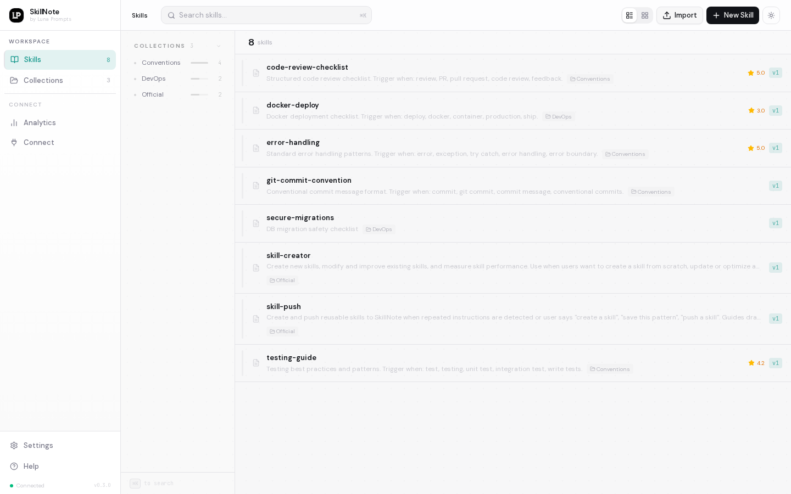
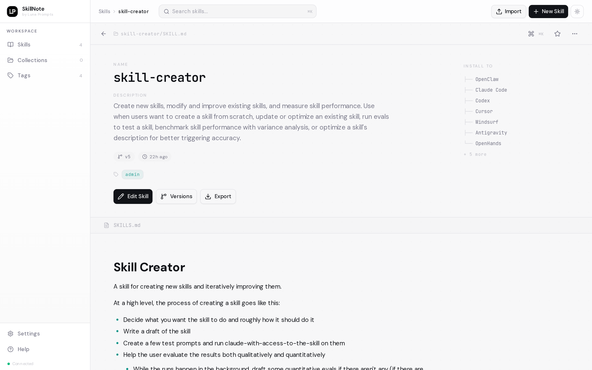
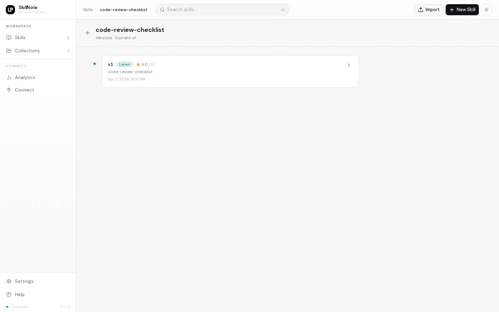

<p align="center">
  
</p>

<h1 align="center">SkillNote</h1>

<p align="center">
  <strong>The open-source skill registry for AI coding agents.</strong>
  <br />
  Create, manage, and distribute <code>SKILL.md</code> files — or connect any agent directly via MCP.
</p>

<p align="center">
  <a href="https://github.com/luna-prompts/skillnote/blob/master/LICENSE"></a>
  <a href="https://github.com/luna-prompts/skillnote"></a>
  <a href="https://github.com/luna-prompts/skillnote/issues"></a>
  
  
</p>

<p align="center">
  <a href="#quick-start">Quick Start</a> &nbsp;&middot;&nbsp;
  <a href="#mcp-server">MCP Server</a> &nbsp;&middot;&nbsp;
  <a href="#features">Features</a> &nbsp;&middot;&nbsp;
  <a href="#cli">CLI</a> &nbsp;&middot;&nbsp;
  <a href="#api-reference">API</a> &nbsp;&middot;&nbsp;
  <a href="#self-hosting">Self-Hosting</a> &nbsp;&middot;&nbsp;
  <a href="#contributing">Contributing</a>
</p>

<br />

---

## Why SkillNote?

AI coding agents like Claude Code, Cursor, and Codex use `SKILL.md` files to learn new capabilities. But managing these files is painful:

- They live scattered across `~/.claude/skills/`, `.cursor/skills/`, `.codex/skills/`
- No versioning, no search, no way to share across projects or teams
- Writing them from scratch means guessing what works

**SkillNote fixes this.** It's a self-hosted registry with a clean web UI, a CLI for one-command installs, and an MCP server that lets any agent connect directly — no file installation needed.

**Why self-hosted?** Enterprise workflows, proprietary codebases, and compliance-sensitive prompts contain institutional knowledge that shouldn't leave your infrastructure. SkillNote runs entirely on your machines. Your skills stay private, versioned, and accessible only to your team.

<p align="center">
  
</p>

---

## Quick Start

Make sure you have [Docker](https://docs.docker.com/get-docker/) and [Docker Compose](https://docs.docker.com/compose/install/) v2+ installed.

```bash
git clone https://github.com/luna-prompts/skillnote.git
cd skillnote
docker compose up --build -d
```

Four containers spin up:

| Service    | URL                        | What it does                            |
| ---------- | -------------------------- | --------------------------------------- |
| **Web**    | http://localhost:3000      | Next.js frontend                        |
| **API**    | http://localhost:8082      | FastAPI backend (auto-migrates + seeds) |
| **MCP**    | http://localhost:8083/mcp  | MCP server — skills as tools            |
| **DB**     | localhost:5432             | PostgreSQL 16                           |

Open **http://localhost:3000** and start creating skills.

> The backend auto-runs migrations and seeds a default skill (`skill-creator`) on first boot. No manual setup needed.

---

## MCP Server

SkillNote includes a built-in [Model Context Protocol](https://modelcontextprotocol.io) server. Instead of installing skill files locally, your agent connects to SkillNote directly and gets every skill as a callable tool — live from the database, no restart needed when skills change.

**How it works:**
- Each skill becomes a tool: `name = slug`, `description = skill description`
- The agent uses the description to decide when to invoke the skill
- Calling the tool returns the full `SKILL.md` content
- Skills added or removed in SkillNote are reflected immediately

### Connect from Claude Code

```bash
claude mcp add --transport http skillnote http://localhost:8083/mcp --scope user
```

Then restart Claude Code. Run `/mcp` to confirm `skillnote` is listed.

### Connect from OpenClaw

Add to `~/.openclaw/settings.json`:

```json
{
  "mcpServers": {
    "skillnote": {
      "type": "http",
      "url": "http://localhost:8083/mcp"
    }
  }
}
```

### Connect from Cursor

Add to your Cursor MCP config (`~/.cursor/mcp.json` or via Settings → MCP):

```json
{
  "mcpServers": {
    "skillnote": {
      "type": "http",
      "url": "http://localhost:8083/mcp"
    }
  }
}
```

### Connect from Windsurf

Add to `~/.codeium/windsurf/mcp_config.json`:

```json
{
  "mcpServers": {
    "skillnote": {
      "type": "http",
      "url": "http://localhost:8083/mcp"
    }
  }
}
```

### Connect from any MCP-compatible agent

Any agent that supports the MCP HTTP transport can connect:

```
http://localhost:8083/mcp
```

### Filter skills by collection or tag

Use environment variables to serve only a subset of skills to a specific agent:

```bash
SKILLNOTE_MCP_FILTER_COLLECTIONS=devops,security docker compose up -d mcp
SKILLNOTE_MCP_FILTER_TAGS=admin,internal docker compose up -d mcp
```

This is useful for scoping what different teams or agents can see.

---

## Features

### Skill Editor
A Notion-style WYSIWYG editor powered by Tiptap. Write in rich text or switch to raw markdown. Paste a raw `SKILL.md` file and it auto-extracts the name, description, and body from the frontmatter.

<p align="center">
  
</p>

### Version History
Every save creates a snapshot. Browse the full history, compare versions, and restore any previous state with one click. Published versions use semantic versioning (`1.0.0`, `1.1.0`, ...) and are distributed as checksummed ZIP bundles.

<p align="center">
  
</p>

### Tags & Collections
Organize skills with tags and collections. Filter, search, and browse by category. Rename or delete tags across all skills at once.

### Multi-Agent Install
Install skills as local files to any AI coding agent from the web UI or CLI. Supported agents:

| Agent       | Install Path                                |
| ----------- | ------------------------------------------- |
| Claude Code | `~/.claude/skills/<skill>/SKILL.md`         |
| Cursor      | `.cursor/skills/<skill>/SKILL.md`           |
| Codex       | `.codex/skills/<skill>/SKILL.md`            |
| OpenClaw    | `~/.openclaw/skills/<skill>/SKILL.md`       |
| OpenHands   | `~/.openhands/skills/<skill>/SKILL.md`      |
| Windsurf    | `.windsurf/skills/<skill>/SKILL.md`         |
| Universal   | `.skills/<skill>/SKILL.md`                  |

### Offline-First
The frontend works without a backend. Skills are stored in localStorage and sync to PostgreSQL when the API is available. No data loss if the backend goes down.

### Keyboard Shortcuts

| Shortcut       | Action          |
| -------------- | --------------- |
| `N`            | New Skill       |
| `Cmd/Ctrl + K` | Focus search    |
| `Cmd/Ctrl + S` | Save (in editor)|
| `Escape`       | Close / Go back |

---

## SKILL.md Format

Every skill is a Markdown file with YAML frontmatter:

```markdown
---
name: pdf-extractor
description: Extract text and tables from PDF files. Use when the user mentions PDFs, scanned documents, or form extraction.
---

# PDF Extractor

When the user provides a PDF file:

1. Use `pdftotext` to extract raw text
2. Identify tables and format them as markdown
3. Preserve headings and document structure
```

### Validation Rules

| Field         | Rule                                                                 |
| ------------- | -------------------------------------------------------------------- |
| `name`        | Required. Lowercase `a-z`, `0-9`, `-` only. Max 64 chars. No reserved words (`anthropic`, `claude`). |
| `description` | Required. Max 1024 chars. Should explain **what** it does and **when** to trigger it. |

> **Tip:** Be aggressive in descriptions. Agents tend to under-trigger skills. Include specific phrases the user might say.

---

## CLI

SkillNote includes a CLI for installing and managing skills from the terminal, no browser needed.

### Install

```bash
cd cli
npm install && npm run build
npm link
```

### Login

```bash
skillnote login --host http://localhost:8082 --token skn_dev_demo_token
```

### Commands

```bash
skillnote list                        # List all skills in the registry
skillnote add pdf-extractor           # Install a skill (auto-detects agent)
skillnote add pdf-extractor --agent claude  # Install for a specific agent
skillnote add --all                   # Install everything
skillnote check                       # Check for updates
skillnote update --all                # Update all installed skills
skillnote remove pdf-extractor        # Uninstall a skill
skillnote doctor                      # Diagnose setup issues
```

---

## Self-Hosting

### Docker Compose (recommended)

```bash
git clone https://github.com/luna-prompts/skillnote.git
cd skillnote
docker compose up --build -d
```

#### Custom host or port

```bash
SKILLNOTE_HOST=192.168.1.100 SKILLNOTE_API_PORT=9000 docker compose up --build -d
```

#### Stop & reset

```bash
docker compose down          # Stop (keeps data)
docker compose down -v       # Stop + wipe database
```

### Local Development

Run the backend in Docker, frontend with hot-reload:

```bash
# Terminal 1: Backend + MCP
docker compose up --build -d postgres api mcp
curl http://localhost:8082/health   # Wait for {"status":"ok"}

# Terminal 2: Frontend
npm install
npm run dev                         # http://localhost:3000
```

### Environment Variables

| Variable                          | Default                 | Description                              |
| --------------------------------- | ----------------------- | ---------------------------------------- |
| `SKILLNOTE_HOST`                  | `localhost`             | Host IP or domain (CORS + frontend URL)  |
| `SKILLNOTE_API_PORT`              | `8082`                  | Host port for the API                    |
| `SKILLNOTE_MCP_PORT`              | `8083`                  | Host port for the MCP server             |
| `SKILLNOTE_DATABASE_URL`          | *(set in compose)*      | PostgreSQL connection string             |
| `SKILLNOTE_BUNDLE_STORAGE_DIR`    | `/app/data/bundles`     | Where versioned ZIP bundles are stored   |
| `SKILLNOTE_MAX_BUNDLE_SIZE_BYTES` | `5242880`               | Max bundle upload size (5 MB)            |
| `SKILLNOTE_CORS_ORIGINS`          | *(auto from host)*      | Comma-separated CORS origins             |
| `NEXT_PUBLIC_API_BASE_URL`        | `http://localhost:8082` | Frontend API endpoint                    |
| `SKILLNOTE_MCP_FILTER_COLLECTIONS`| *(all)*                 | Comma-separated collections to expose via MCP |
| `SKILLNOTE_MCP_FILTER_TAGS`       | *(all)*                 | Comma-separated tags to expose via MCP   |

---

## API Reference

All endpoints except `/health` require `Authorization: Bearer <token>`.

```bash
curl http://localhost:8082/v1/skills \
  -H "Authorization: Bearer skn_dev_demo_token"
```

### Skills

| Method   | Endpoint                                          | Description                |
| -------- | ------------------------------------------------- | -------------------------- |
| `GET`    | `/v1/skills`                                      | List all skills            |
| `POST`   | `/v1/skills`                                      | Create a skill             |
| `GET`    | `/v1/skills/{slug}`                               | Get skill details          |
| `PATCH`  | `/v1/skills/{slug}`                               | Update a skill             |
| `DELETE` | `/v1/skills/{slug}`                               | Delete a skill             |

### Versioning

| Method   | Endpoint                                                       | Description              |
| -------- | -------------------------------------------------------------- | ------------------------ |
| `GET`    | `/v1/skills/{slug}/content-versions`                           | List content snapshots   |
| `POST`   | `/v1/skills/{slug}/content-versions/{version}/set-latest`     | Set version as latest    |
| `POST`   | `/v1/skills/{slug}/content-versions/{version}/restore`        | Restore a version        |
| `GET`    | `/v1/skills/{slug}/versions`                                   | List published versions  |
| `POST`   | `/v1/publish`                                                  | Publish a bundle         |
| `GET`    | `/v1/skills/{slug}/{version}/download`                        | Download a bundle        |

### Tags

| Method   | Endpoint             | Description                         |
| -------- | -------------------- | ----------------------------------- |
| `GET`    | `/v1/tags`           | List all tags with counts           |
| `PATCH`  | `/v1/tags/{name}`    | Rename a tag (updates all skills)   |
| `DELETE` | `/v1/tags/{name}`    | Delete a tag (removes from all)     |

### Auth

| Method   | Endpoint                  | Description          |
| -------- | ------------------------- | -------------------- |
| `GET`    | `/health`                 | Health check         |
| `POST`   | `/auth/validate-token`    | Validate a token     |

---

## Tech Stack

| Layer      | Technology                                              |
| ---------- | ------------------------------------------------------- |
| Frontend   | Next.js 16, React 19, TypeScript, Tailwind CSS 4, Tiptap |
| Backend    | Python 3.12, FastAPI, SQLAlchemy 2, Alembic, Pydantic 2 |
| MCP Server | Python 3.12, FastMCP                                    |
| Database   | PostgreSQL 16                                           |
| CLI        | Node.js, TypeScript, Commander.js                       |
| Infra      | Docker, Docker Compose                                  |

---

## Project Structure

```
skillnote/
├── src/                          # Next.js frontend
│   ├── app/(app)/                #   App Router pages
│   │   ├── page.tsx              #     Home: skill list + search
│   │   ├── skills/new/           #     Create skill (full-page editor)
│   │   ├── skills/[slug]/        #     Skill detail + edit
│   │   ├── collections/          #     Browse by collection
│   │   ├── tags/                 #     Browse by tag
│   │   └── settings/             #     About
│   ├── components/               #   UI components
│   │   ├── skills/               #     Editor, detail view, install strip
│   │   ├── layout/               #     Sidebar, topbar
│   │   └── ui/                   #     Primitives (Shadcn)
│   └── lib/                      #   State, API client, validation
│
├── backend/                      # FastAPI backend + MCP server
│   ├── app/api/                  #   Route handlers
│   ├── app/db/models/            #   SQLAlchemy models
│   ├── app/schemas/              #   Pydantic schemas
│   ├── app/validators/           #   SKILL.md spec validators
│   ├── alembic/                  #   Database migrations
│   ├── scripts/                  #   Seed data, health checks
│   ├── mcp_server.py             #   MCP server (FastMCP, port 8083)
│   └── Dockerfile.mcp            #   MCP container
│
├── cli/                          # CLI tool
│   └── src/
│       ├── commands/             #   login, list, add, update, remove, doctor
│       └── agents/               #   Agent detection + install paths
│
├── docker-compose.yml            # Full stack orchestration
├── Dockerfile                    # Frontend multi-stage build
└── start.sh                      # One-command startup
```

---

## Troubleshooting

<details>
<summary><strong>Containers won't start</strong></summary>

```bash
docker compose logs api       # Check API logs
docker compose logs mcp       # Check MCP logs
docker compose logs postgres  # Check DB logs
```
</details>

<details>
<summary><strong>MCP server not showing up in agent</strong></summary>

Verify the MCP server is running:

```bash
curl -s -X POST http://localhost:8083/mcp \
  -H "Content-Type: application/json" \
  -H "Accept: application/json, text/event-stream" \
  -d '{"jsonrpc":"2.0","id":1,"method":"initialize","params":{"protocolVersion":"2025-03-26","capabilities":{},"clientInfo":{"name":"test","version":"1"}}}'
```

You should see `"name":"SkillNote"` in the response. Then restart your agent.
</details>

<details>
<summary><strong>API returns 401 / 403</strong></summary>

Make sure the backend has been seeded:

```bash
docker compose exec -T api python scripts/seed_data.py
```

Use token `skn_dev_demo_token` for development.
</details>

<details>
<summary><strong>Port already in use</strong></summary>

```bash
SKILLNOTE_API_PORT=9000 SKILLNOTE_MCP_PORT=9001 docker compose up --build -d
```
</details>

<details>
<summary><strong>Reset everything</strong></summary>

```bash
docker compose down -v
docker compose up --build -d
```
</details>

---

## References

- [Claude Code Skills](https://platform.claude.com/docs/en/agents-and-tools/agent-skills/overview) - Anthropic's official skills documentation
- [Model Context Protocol](https://modelcontextprotocol.io) - MCP specification
- [AgentSkills.io](https://agentskills.io/home) - The skills ecosystem
- [Codex Skills](https://developers.openai.com/codex/skills/) - OpenAI Codex skills reference
- [OpenHands Skills](https://docs.openhands.dev/overview/skills) - OpenHands skills overview

---

## Star Us

If you find SkillNote useful, please consider giving it a star on GitHub. It helps others discover the project and motivates us to keep improving it.

<p align="center">
  <a href="https://github.com/luna-prompts/skillnote"></a>
</p>

---

## Contributing

Contributions are welcome! Here's how:

1. Fork the repository
2. Create a feature branch (`git checkout -b feat/my-feature`)
3. Commit your changes (`git commit -m 'feat: add my feature'`)
4. Push to the branch (`git push origin feat/my-feature`)
5. Open a Pull Request

Please follow [Conventional Commits](https://www.conventionalcommits.org/) for commit messages.

---

## License

MIT &copy; [Luna Prompts](https://github.com/luna-prompts)

---

<p align="center">
  Made with ❤️ by <a href="https://github.com/luna-prompts"><strong>Luna Prompts</strong></a>
</p>
